<div align="center">

**English** · [简体中文](README.zh-CN.md)

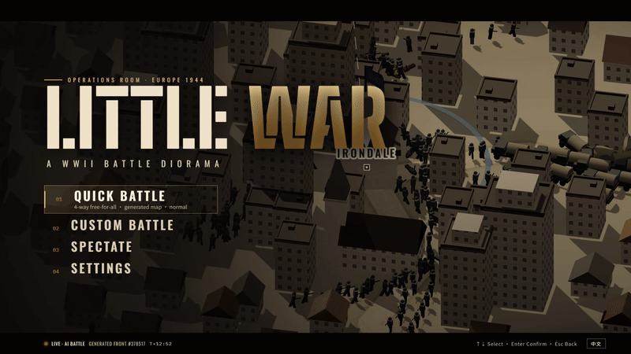

# LITTLE WAR

**A WWII real-time battle diorama.** Plan a nation's war effort, then watch thousands of soldiers fight along a living front on a procedurally generated map: rivers, mountain passes, villages, towns and cities that are worth dying for.

[](https://github.com/Zwl20085/LittleWarGame/releases/latest)
&nbsp;
[](https://github.com/Zwl20085/LittleWarGame/releases)


[What's new](#whats-new-in-10) · [Features](#features) · [Download](#download-and-play) · [How a war plays](#how-a-war-plays) · [Controls](#controls) · [Under the hood](#under-the-hood) · [Build from source](#build-from-source)

</div>

---

## What's new in 1.0

- **Soldiers move like people.** Each soldier walks to his place in the formation at a capped pace, turns gradually and strides by the distance he covers. A marching column wheels through a bend instead of turning as one rigid block, and gun crews walk round the gun as it traverses.
- **Terrain and buildings fight.** Squads garrison houses and fire from the windows until HE brings the building down. High ground aims and spots better, a crest shields defenders, forests hide troops that hold fire, and fords and bridges leave them exposed. The AI holds town edges and crests.
- **An orchestral score.** Themes for each level of fighting, a tension build, a battle ostinato, a lament, and victory and defeat stingers. It is composed bar by bar and played on an orchestra that is synthesized in a worker when the game starts.
- **A sharper AI.** The rules for choosing battle plans were retuned from a strategy lab that records every operation: success rose from 42 % to 58 %. A dominant side now concentrates its army groups on an enemy capital, so wars reach an end.
- **Faster.** 8× speed keeps up with about 500 units. The mean simulation tick is 2.7 ms at about 460 units, down from 4.5 ms. Settlement markers are instanced, and a new **Graphics quality** setting (auto / high / medium / low) has an auto mode that steps down when frames run slow.

## Features

<table>
  <tr>
    <td width="50%">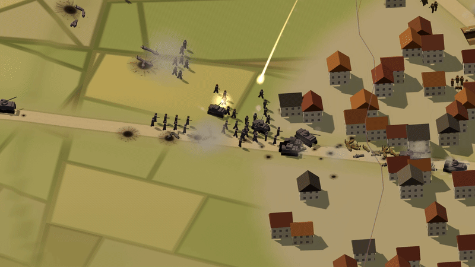</td>
    <td width="50%">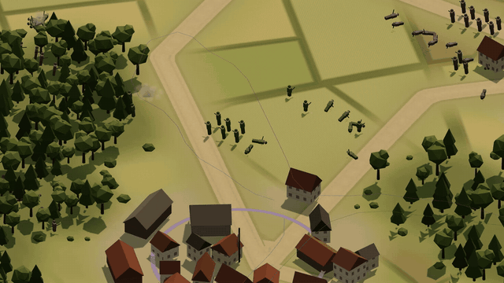</td>
  </tr>
  <tr>
    <td><b>Artillery you can follow with your eyes.</b> Mortar and howitzer shells fly real ballistic arcs over ridges and roofs, leave glowing trails, and burst on walls and fields. Batteries are sound-ranged by the enemy and must relocate after a few salvos.</td>
    <td><b>Real fronts, not lanes.</b> Ground control is computed from where troops stand. Army groups hold good ground, push when stronger and launch armoured spearheads through weak points. Tanks are tough enough to lead the attack, and AT guns are what stops them.</td>
  </tr>
  <tr>
    <td>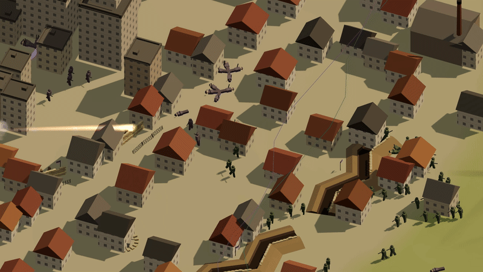</td>
    <td>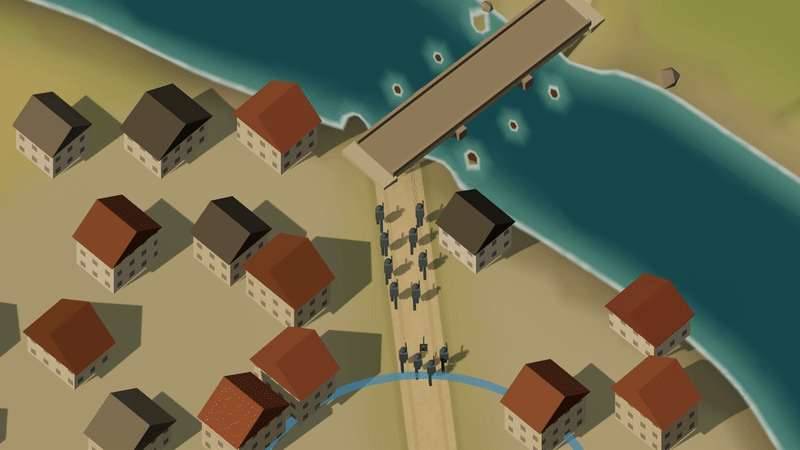</td>
  </tr>
  <tr>
    <td><b>Towns are solid and worth holding.</b> Every building has collision: troops move through the streets, and walls block sight lines, direct fire and incoming shells. Each town adds income, production and population, so a theatre <i>high command</i> garrisons threatened towns and sends detachments to occupy open ones.</td>
    <td><b>Rivers shape the war.</b> Valleys carry rivers with bridges and fords. Groups stage before a crossing, mass, then force it, and engineers throw pontoon bridges across when the nearest crossing is a long detour.</td>
  </tr>
  <tr>
    <td>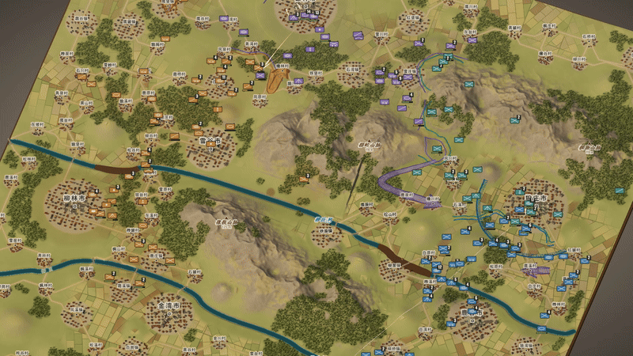</td>
    <td>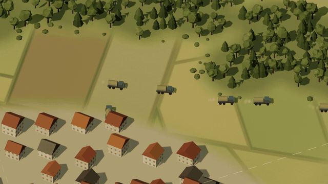</td>
  </tr>
  <tr>
    <td><b>Every map is new.</b> Each seed builds a large map (about 3.6 km square for four sides) with mountain ranges and passes, rivers along the valleys, forests, a field patchwork, over a hundred villages, street-grid towns, cities with towers, and a capital per faction.</td>
    <td><b>Supply you can see and cut.</b> Trucks shuttle ammunition from depots (capital and held towns; efficiency drops with distance) to the lines. Raiders slip through weak stretches of the front to ambush convoys; rear guards hunt them.</td>
  </tr>
  <tr>
    <td>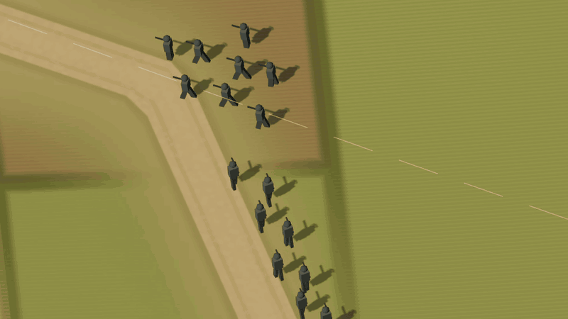</td>
    <td>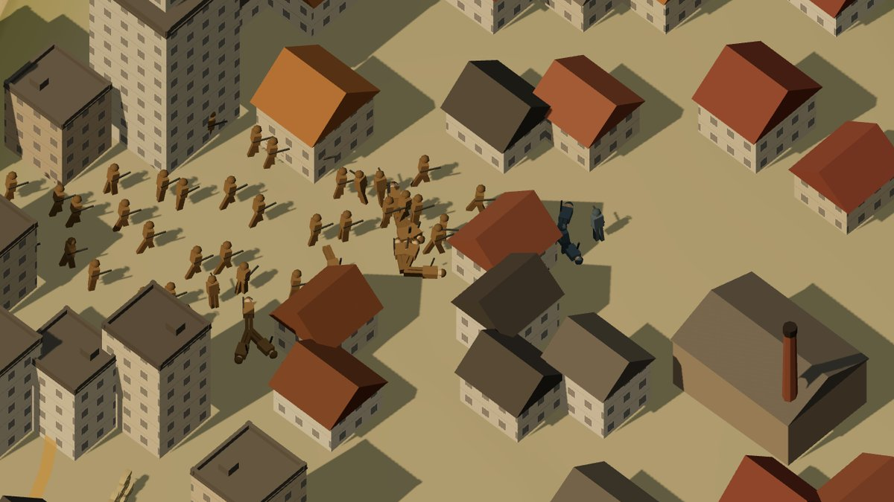</td>
  </tr>
  <tr>
    <td><b>Soldiers, not tokens.</b> Every soldier walks to his own place in the formation at a walking pace, turns gradually and strides by the ground he covers, so feet don't slide. On roads a squad marches in file or column and wheels through bends along the leader's path. Gun crews walk round their piece as it traverses.</td>
    <td><b>Terrain and buildings fight too.</b> Squads shelter behind houses and fire from the windows, with heavy cover on that side, until HE brings the building down. Church towers and steeples serve as observation posts. Troops that hold fire in a forest are only spotted at close range. High ground improves aim and artillery spotting, and a crest hides defenders from fire coming uphill. Fords and bridges leave troops exposed. When it holds a line, the AI picks the enemy-facing edges of towns and woods, crests and the lee side of buildings.</td>
  </tr>
</table>

### Battle plans, sieges and doctrines

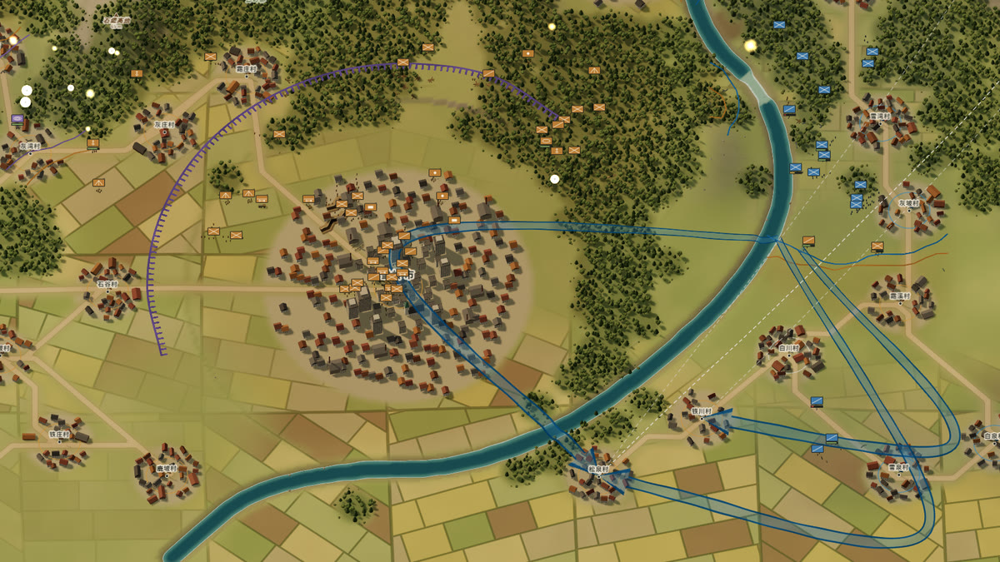

Every army group attacks with a **battle plan**, drawn on the map as a war-room arrow. The AI picks one from its force mix, the target and its doctrine, or you can lock one per group:

| Plan | What the troops do |
|---|---|
| **Frontal push** | The whole line advances steadily. |
| **Flank** | A mobile group (tanks, motorized rifles, recon) swings round to a waypoint on the weaker side, forms up, then strikes from the side while the line pins the enemy. |
| **Pincer** | Both wings swing round and close on the same objective together. |
| **Infiltrate** | Small rifle teams slip through the weakest stretch of the enemy line to seize the objective. |
| **Siege** | Against a defended town: ring it outside direct-fire range and dig trench lines. Storm it once the garrison is worn down. |

<table>
  <tr>
    <td width="50%">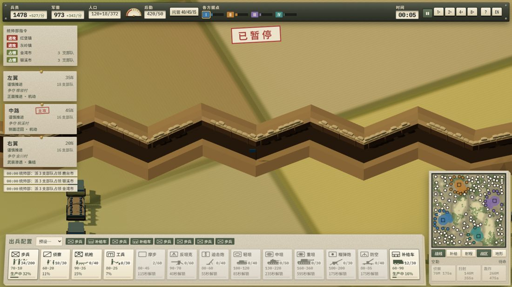</td>
    <td width="50%">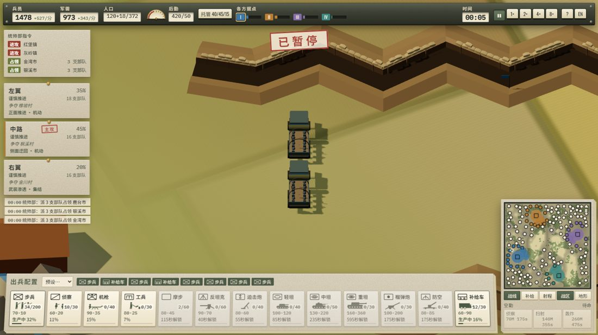</td>
  </tr>
  <tr>
    <td><b>Field works.</b> Besiegers dig zig-zag trenches, and garrisons stack sandbag barricades. Troops behind finished works get the best cover against shells and fire from the front, so neither side can simply shell the other off the map. Digging costs manpower.</td>
    <td><b>Motorized rifles.</b> They ride trucks on long, safe trips and dismount near the enemy, when fired on or at the end of the trip. They are fast for flanks and quick captures, but vulnerable while mounted.</td>
  </tr>
</table>

**Doctrine.** Before a battle, choose *balanced*, *infantry first*, *armour first*, *mechanized* or *artillery first*. Your doctrine sets your production mix and the plans your groups prefer. Each AI faction has its own doctrine.

<div align="center">
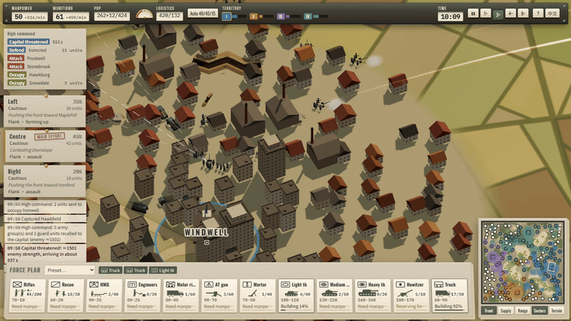
<br/><sub>The war-room HUD. Top left: high-command directives (defend / attack / occupy). Below them: army groups and the event log. Bottom: production. Bottom right: minimap. Chinese by default, English with one click.</sub>
</div>

Also inside:
- **Territory is the economy.** Your capital alone feeds about a third of a full army. Villages supply recruits (manpower), and towns and cities supply industry (munitions), production slots and population. The mobilisation and industry sliders scale the output of all your territory. Losing ground shrinks your war effort, and losses take real time and money to replace.
- **Thousands of soldiers.** Several hundred tactical units (squads, guns, tanks, trucks) with instanced rendering. Squads change formation with the situation (file on the road, wedge or teams on the move, a firing line in contact), and zoom-level unit counters keep the picture readable.
- **An orchestral score.** The music follows the fighting: a calm main theme, a tension theme as the fighting builds, a battle ostinato under heavy fire, a lament when you are losing ground, and stingers for victory, defeat and a fallen capital. A composer writes it bar by bar in 8-bar phrases with voice-led harmony and seeded variation, and plays it on strings, horns, brass, reeds, timpani and snare synthesized in a worker. Rifle volleys, MG bursts, cannon and shell whistles are synthesized too. The game ships no audio files; `npx vite-node scripts/music-preview.ts` renders the score to WAV files so you can listen offline.
- **Rules first.** Armour facing and penetration, HE blast, cover, suppression, morale, and line of sight over terrain and buildings all follow a written balance spec.

## Download and play

| | |
|---|---|
| **Windows (recommended)** | Download from **[Releases](https://github.com/Zwl20085/LittleWarGame/releases/latest)**. `LittleWar-<version>-portable.exe` is a single file with nothing to install. `LittleWar-<version>-setup.exe` is an installer with Start-menu and desktop shortcuts. |
| **Any OS, from source** | `npm install` then `npm run dev` and open http://localhost:5173, or `npm run app` for the desktop window. |

> [!NOTE]
> The Windows build is not code-signed, so SmartScreen may warn on first launch. Choose **More info → Run anyway**. You need a GPU with WebGL2 (any graphics card from the last ~8 years). Press **F11** for fullscreen.

## How a war plays

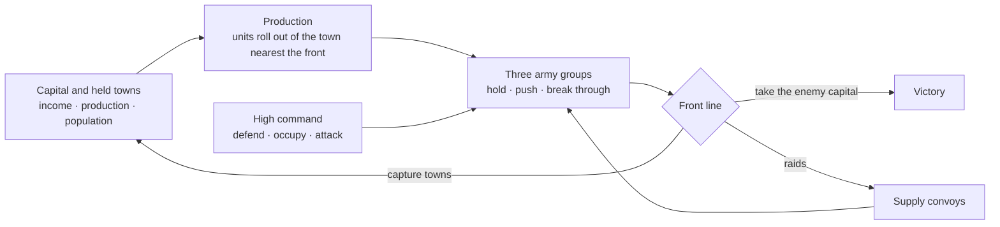

1. **Mobilise.** Your capital and held towns produce units according to the weights in the bottom bar. A steward balances mobilisation, industry and logistics, or you take over.
2. **Command.** Units join three army groups. Set a group's posture (cautious / assault / hold / fortify / withdraw) or its target, and the AI handles the rest: holding river lines, massing before crossings, pushing, breaking through. The high command keeps your towns garrisoned.
3. **Fight for ground.** Every one of the 100+ settlements can be captured. Each one you take feeds your economy and starves the enemy's.
4. **Win.** A side is defeated only when enemy infantry capture its **capital**. No resolve meter and **no time limit**: you can lose half your land and still fight back. Once one side dominates, its high command turns every army group on the weakest, nearest enemy capital to finish the war.

## Controls

| Input | Action |
|---|---|
| Left click / drag | Select units (Shift adds) |
| Right click ground / enemy | Move / focus fire |
| <kbd>A</kbd> <kbd>H</kbd> <kbd>R</kbd> <kbd>G</kbd> | Attack-move · hold · retreat · resume automatic |
| <kbd>W</kbd><kbd>A</kbd><kbd>S</kbd><kbd>D</kbd> or middle-drag, <kbd>Q</kbd>/<kbd>E</kbd>, wheel | Pan · rotate · zoom |
| <kbd>Ctrl</kbd>+wheel or <kbd>PgUp</kbd>/<kbd>PgDn</kbd>, <kbd>Tab</kbd> | Camera pitch · overview |
| <kbd>1</kbd> <kbd>2</kbd> <kbd>3</kbd> | Army-group panels (posture, target, share) |
| <kbd>Space</kbd> <kbd>U</kbd> <kbd>Esc</kbd> | Pause · hide HUD · menu |
| <kbd>F11</kbd> · <kbd>Ctrl</kbd>+<kbd>Shift</kbd>+<kbd>I</kbd> | Fullscreen · developer console (desktop app) |

Game speed: 1× / 2× / 4× / 8×. If the simulation can't keep up, the game slows down and shows a notice. It never skips ticks.

**Graphics quality** (Settings, on the title screen or in the Esc menu): *auto* (default), *high*, *medium* or *low*. Auto drops one tier after about 3 s of slow frames and tells you when it does.

## Under the hood

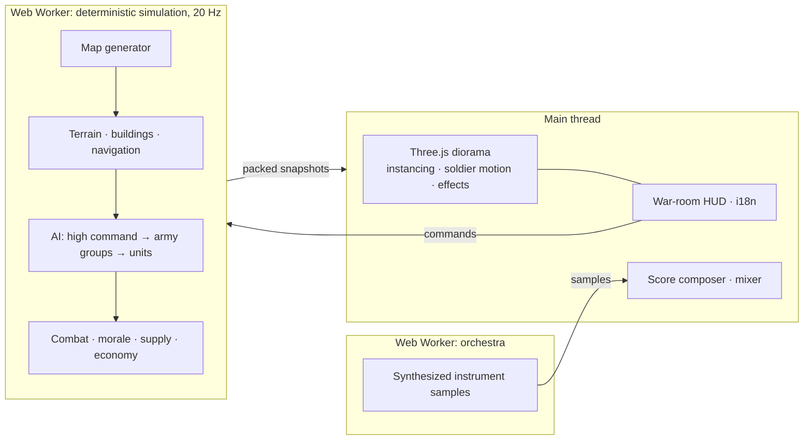

- **Deterministic simulation.** Fixed 20 Hz ticks with seeded RNG, so the same seed and the same commands give the same war. A test checks this. The simulation runs in a Web Worker, and the main thread only draws.
- **Data-oriented hot paths.** Lazy flow fields (Dial's algorithm) are shared per goal, and paths are built in 320 m stretches. A cell-sorted spatial hash handles queries, and a 2 m building raster with local detours handles movement through towns. In the 1.0 round the mean tick fell from 4.5 ms to 2.7 ms at about 460 units, and the worker kept up with 8× speed with 360–500 units on the dev machine ([docs/PERFORMANCE.md](docs/PERFORMANCE.md)).
- **Render budget.** Settlement markers are drawn as 4 instanced meshes instead of about 600, which halves the scene's object count. Each soldier is a few floats in a flat array, stepped every frame, with no per-soldier objects. Quality tiers set the shadow map, pixel ratio and scatter.
- **Numbers you can inspect.** Balance and AI changes are tested in headless AI-vs-AI wars before they ship:
  - `scripts/balance.ts` prints a ledger for each unit type, a kill matrix and an economy timeline.
  - The **balance lab** (`scripts/lab.ts`) runs A/B experiments with data overrides on the same seeds and checks army fullness, hoarding, attrition and territory churn against target bands ([docs/BALANCE_LAB.md](docs/BALANCE_LAB.md), Chinese).
  - The **strategy lab** (`scripts/strategy.ts`) records every operation, engagement and capture, then reports which plans work against which odds and terrain ([docs/STRATEGY_LAB.md](docs/STRATEGY_LAB.md)). With the retuned plan rules, operation success went from 42 % to 58 % and captures per match rose 17 % (8 seeds × 20 min).
  - The **soak test** (`scripts/soak.ts`) plays whole wars and flags NaNs, stuck units, idle groups and slow ticks.

<details>
<summary><b>Sample balance ledger</b> (<code>npx tsx scripts/balance.ts 15 7</code>: 1 seed × 15 min, 4 AI factions)</summary>

```
== Operations launched / won ==
flank 38  frontal 24  infiltrate 16  pincer 9  won:flank 22  won:infiltrate 1  won:pincer 7

type            built  lost  K/D   kills  dmgOut  dmgIn  dmg/min/unit  value-kill/spent  dmg/cost  share
infantry          120    87  0.94     82     66k    87k         25.9             0.79      6.92  48.9%
light_tank         33     5  6.20     31     29k   8.1k        128.1             0.38      3.99  21.3%
medium_tank        13     1 18.00     18     17k   6.0k        246.6             0.50      3.69  12.4%
recon              61    32  0.31     10    9.8k    18k         11.7             0.18      2.02   7.2%
howitzer           26     2  1.50      3    7.4k   2.8k         56.5             0.09      0.94   5.4%
at_gun             18     2  3.00      6    5.1k    952         32.2             0.34      1.76   3.7%
```

It also prints an attacker × victim kill matrix, damage shares by attacker for each victim type, and an economy timeline: units, population against cap, settlements held, income and stock per faction every 5 minutes.
</details>

## Build from source

Requires Node.js 18+.

```bash
npm install
npm run dev          # browser: http://localhost:5173
npm run app          # desktop window (Electron)
npm run dist:win     # Windows portable .exe + installer → release/
```

<details>
<summary><b>Development commands</b></summary>

```bash
npm test                                          # unit, rule, map and AI smoke tests (vitest)
npm run typecheck
LONGRUN=1 npx vitest run tests/longrun.test.ts    # full-length AI wars

# Balance and AI
npx tsx scripts/balance.ts 15 7                   # unit ledger, kill matrix, economy (minutes, seeds)
npx tsx scripts/lab.ts --seeds 7,11 --minutes 30 --ab --set unit.infantry.cost_p=90  # balance lab A/B
npx tsx scripts/strategy.ts --seeds 7,11,13 --minutes 20 --compare  # strategy lab: plan outcomes, A/B
npx tsx scripts/soak.ts 45 7,11,13                # whole wars: outcome, anomalies, tick cost (minutes, seeds)

# Performance
npx tsx scripts/perf.ts generated 600 7           # headless ms/tick (mean, p99), stuck units, supply health
node scripts/profile.mjs                          # V8 CPU profile of the same run, hottest functions
node scripts/perf-browser.mjs                     # real game in headless Edge at 8×: fps, renderer phases

# Media
npx vite-node scripts/music-preview.ts            # render the score's scenarios to WAV → media/stats/music
node scripts/capture.mjs                          # record gameplay clips → media/clips
node scripts/capture-page.mjs hero hud --lang en  # record title / HUD clips → media/page
```

URL shortcuts: `?quick` (hand-made 4-way map), `?quick&map=gen&seed=42`, `?quick&map=1v1`, `&fog`, `&spectate`.

Trailer: `cd trailer && npm i && npx remotion studio` to preview. `npx remotion render src/index.ts Trailer ../media/trailer.mp4` exports it.
</details>

<details>
<summary><b>Project layout</b></summary>

```
src/sim/      deterministic simulation: map generator, terrain and buildings, navigation,
              economy, production, combat, morale, supply convoys, front analysis,
              AI (high command / city / army groups / units), stats ledger
src/render/   Three.js diorama: instanced units, soldier motion, terrain, water, settlements,
              artillery FX, quality tiers
src/ui/       war-room HUD, title screen, high-command card, settings, i18n (zh / en)
src/audio/    score composer and themes, synthesized orchestra (worker), sound effects (Web Audio)
scripts/      balance and strategy labs, soak test, perf and profiling tools, capture scripts
electron/     standalone desktop shell (serves the built game over app://)
docs/         design documents (Chinese) and docs/data/*.csv|json: unit, weapon and rule data
tests/        rule, terrain, map-generation, determinism and AI smoke tests
trailer/      Remotion project for the promo trailer
```

Design docs (Chinese): [docs/README.md](docs/README.md). Implementation-time decisions are listed in `docs/GAME_DESIGN.md` §2.1.1.
</details>

## Status

**v1.0.** Balance and AI are tuned from headless AI-vs-AI wars, not yet from much human play. Planned: save/load and replays, AT obstacles and minefields, alliances (the data model already supports them), bundled fonts for fully offline play.

**Known limitations:** the orchestra is synthesized, not recorded, and sounds like it. Single player only: there is no multiplayer. The Windows build is not code-signed.

## License

MIT. See [LICENSE](LICENSE). The trailer is built with [Remotion](https://www.remotion.dev/), which is free for individuals and teams of up to 3.
