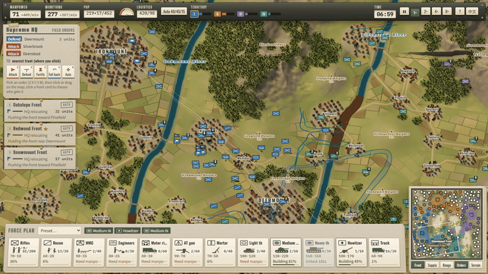
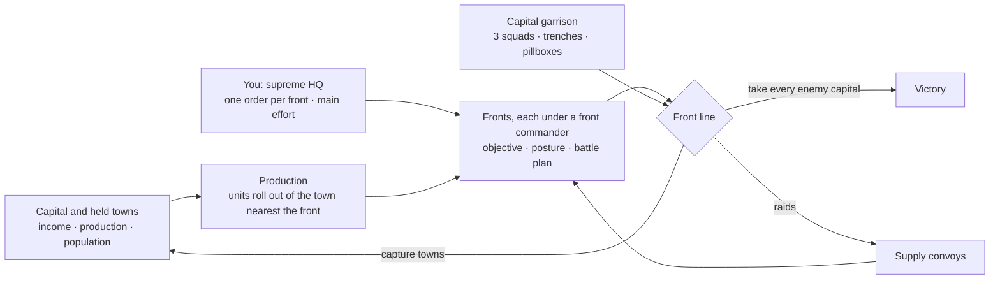
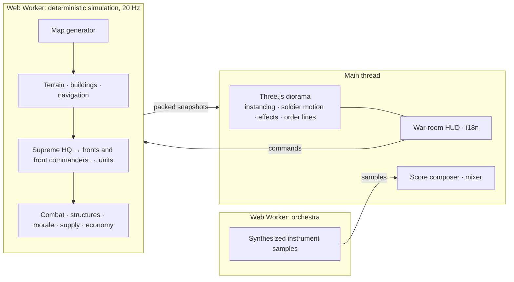

<div align="center">

**English** · [简体中文](README.zh-CN.md)


# LITTLE WAR

**A WWII real-time battle diorama.** Plan a nation's war effort, then watch thousands of soldiers fight along a living front on a procedurally generated map: rivers, mountain passes, villages, towns and cities that are worth dying for.

[](https://github.com/Zwl20085/LittleWarGame/releases/latest)
&nbsp;
[](https://github.com/Zwl20085/LittleWarGame/releases)


[What's new](#whats-new-in-20) · [Features](#features) · [Download](#download-and-play) · [How a war plays](#how-a-war-plays) · [Controls](#controls) · [Under the hood](#under-the-hood) · [Roadmap](#roadmap) · [Build from source](#build-from-source)

</div>

---

## What's new in 2.1

- **Fortified zones are permanent works.** A Fortify order registers a zone; a later order to the same front never cancels it. Zones keep building from the supreme-HQ card's **Fortified zones** list (progress, who holds it, cancel) and stay on the map as stencils. Engineers of any front finish them.
- **As many fronts as you need.** Open a front anywhere with <kbd>N</kbd> (up to 8; the commander costs 120 P and free troops within 350 m join it), disband one from its card, pick fronts with <kbd>1</kbd>–<kbd>8</kbd>. The AI runs up to 8 fronts too and opens garrison fronts for its finished zones.
- **Orders are binding.** A front under your order sends out no occupation, raid or rear-guard detachments; an attack order goes without the "outmatched" hold; a defend or fortify order keeps every unit on the line and mans its works first. Cards stamp **奉命 / ordered** for your orders and the expanded card shows how many units are in position.
- **Works that are worth it.** Pillboxes cost 6 P + 50 M (2 750 HP) and carry their own 200 m machine gun; bunkers 12 P + 100 M (5 625 HP) and sharpen their occupants' fire; trenches are cheaper. Capitals start with finished pillboxes at their strongpoints plus engineers in the field, and the supreme HQ queues engineers whenever works are waiting. In the soak, manned works went from 2 squads per side to 66–93 % of all slots.
- **Production follows demand.** When sites wait and no engineer is free, engineers are queued automatically (also for you; pausing the engineer line stops it).
<!-- VISUALS_21 -->

<details>
<summary><b>What was new in 2.0</b></summary>

## What's new in 2.0

- **You are the supreme HQ.** The fixed left / centre / right sectors are gone. You command *fronts*, and you give each front one standing order on the map: **Attack**, **Defend**, **Fortify**, **Fall back** or **Auto**. Click for a point, drag for a line. Each order is drawn as an inked war-map line with a stamp naming the front. An order far from every front opens a new front (up to 4). The AI supreme HQ opens, merges and dissolves its own fronts and gives its orders through the same command API as you ([docs/COMMAND_V2.md](docs/COMMAND_V2.md)).
- **Front commanders.** A commander on the map leads each front: a four-man staff (officer with a map, radio operator, two guards) under an HQ pennant, 2 400 HP. The commander posts at the nearest safe own town behind the line and, inside your order, picks the objective, posture, battle plan and battle line. Kill one and the front only holds its ground for a minute; a replacement is appointed after 90 s.
- **Pillboxes and bunkers.** Engineers build pillboxes (10 P + 80 M, 70 s, 2 200 HP, one squad, built-in MG, blind rear arc) and bunkers (20 P + 160 M, 120 s, 4 500 HP, two squads or an AT gun). A **Fortify** order lays out a fortified zone along your line: trenches, a pillbox at each end and a bunker behind the middle. Every capital now keeps a standing garrison of 3 squads and an engineer-built line of 2 trenches and 2 pillboxes from the first minutes.
- **Armoured and motorized thrusts.** A front with 3 or more spare tanks or motorized squads breaks through at a 1.5× local edge every 75 s, with armour and motor rifles in the lead. Motorized rifles on a thrust stay in their trucks until the enemy is within 220 m. The medium tank now has 2 100 HP, 2.8 m/s and a 130-damage gun, and the light tank does 3.3 m/s. Tanks crack concrete: a pillbox takes 4 hits from a heavy tank or 7 from a medium. The AT gun is still the best tank killer: its share of tank kills rose from 13 % to 21 % ([BALANCE_SPEC §2.7](docs/BALANCE_SPEC.md)).
- **Challenge lab.** `scripts/challenge.ts` plays one faction with a scripted strategy (rush at 3 / 5 / 10 min, turtle, two axes, raids, late blitz, a human-like player, every unit on the capital) against three AI factions through the real command API. It reports whether the AI kept its capital and how it defended ([docs/CHALLENGE_LAB.md](docs/CHALLENGE_LAB.md)).
- **Heavier fire.** Explosions now depend on what they hit: water splashes, collapsing buildings that throw dust and rubble, roof hits, AP sparks and vehicle cook-offs. Guns fire tapered flames with smoke rings, tracers glow brighter, wrecks burn with embers that die down, and shelled ground gets a faint haze (high quality tier).
- **Still fast.** The enemy-distance transform runs on a coarser grid (2.8 % → 0.8 % of sim CPU), defensive-position and cover searches are cached, and forts are looked up through a per-tick index. The 2.0 planner thinks every 5 s and adds no per-tick work. In the browser the renderer frame takes 4.8 ms at the overview and 3.3–3.5 ms in battle views, and 8× speed holds.

</details>

<details>
<summary><b>What was new in 1.1 and 1.0</b></summary>

**1.1**

- **Stronger artillery.** Mortars and howitzers lead moving targets and no longer burst on their own gun line. Shells hit harder and burst wider (howitzer 180 damage in a 16 m radius, mortar 125 in 11 m), so two guns can break a squad caught in the open in a few salvos. Fewer, cheaper howitzers keep artillery at about a fifth of all kills.
- **Unit identity audit.** Every unit's damage and HP were checked against what its name promises. The heavy tank's gun now hits like one (150 → 210), and the balance spec matches the data again.
- **High command defends the capital.** It forecasts the threat from enemy groups aimed at the capital and closing in, recalls the nearest, least engaged groups, sends home guards and digs trench rings on the approach. In the strategy lab, capitals lost to attacks the army could have stopped fell from 7 to 0 (6 seeds × 45 min).
- **Siege and storm.** Groups ring a fortified capital, bring every gun into range, storm once they have the mass and dig in if the storm stalls.
- **Crews deploy where the fighting is.** MGs and AT guns go to the stretch of front that is in contact, and fire about twice as often.
- **A territory-driven army.** The population cap grows with the land you hold. Victory is still only by taking every enemy capital.
- **Faster again.** Snapshots apply in half the time, and the scene has a quarter fewer objects ([docs/PERFORMANCE.md](docs/PERFORMANCE.md)).

**1.0**

- **Soldiers move like people.** Each soldier walks to his place in the formation at a capped pace, turns gradually and strides by the distance he covers.
- **Terrain and buildings fight.** Squads garrison houses and fire from the windows until HE brings the building down. High ground aims and spots better, a crest shields defenders, and forests hide troops that hold fire.
- **An orchestral score**, composed bar by bar and played on an orchestra synthesized in a worker.
- **A sharper AI.** Battle-plan rules retuned from the strategy lab: operation success rose from 42 % to 58 %.
- **Faster.** The mean simulation tick fell from 4.5 ms to 2.7 ms at about 460 units, and a new **Graphics quality** setting arrived.

</details>

## Features

<div align="center">

<br/><sub><b>Supreme HQ orders.</b> Pick an order (<kbd>Z</kbd> <kbd>X</kbd> <kbd>C</kbd> <kbd>V</kbd> <kbd>B</kbd>), then click a place or drag a line. Here one front gets a defence line and another an attack. Each standing order is an inked line with a stamp, and the front commander's own plan arrows run underneath. Top left: the supreme-HQ card with the order palette and one card per front. Bottom: production. Bottom right: minimap. Chinese by default, English with one click.</sub>
</div>
<br/>

<table>
  <tr>
    <td width="50%"></td>
    <td width="50%"></td>
  </tr>
  <tr>
    <td><b>Front commanders you can see.</b> Each commander is a staff of four under an HQ pennant. It posts at the nearest safe own town behind its line, fights only in self-defence and steps back from armed enemies. Inside your order it chooses the objective, the posture and the battle plan, and the front card says why. Lose the commander and the front holds without pushing for a minute; a replacement is appointed after 90 s if the HQ can pay for it.</td>
    <td><b>Pillboxes, bunkers and fortified zones.</b> Engineers build them, and squads move in when they stop next to one. A pillbox's squad fires a built-in MG that cannot cover the rear. A bunker takes two squads or an AT gun. The garrison stays hidden until it opens fire. Buildings cost no population. Tanks can crack them, but AP shot is capped on concrete, so the AT gun stays a tank killer.</td>
  </tr>
  <tr>
    <td></td>
    <td></td>
  </tr>
  <tr>
    <td><b>Armoured thrusts.</b> Fronts with spare tanks or motorized squads break through at a smaller local edge than infantry fronts, with armour in the lead and motor rifles riding behind until the enemy is close. Light tanks exploit the gap, and medium tanks have the HP and the gun to lead a breakthrough.</td>
    <td><b>Effects that depend on what is hit.</b> Shells splash in rivers, bring houses down in dust and rubble, burst on roofs and spark off armour. Vehicles cook off and their wrecks keep burning. Guns throw tapered flames with smoke rings, and ground that has been shelled for a while lies under a faint haze.</td>
  </tr>
  <tr>
    <td></td>
    <td></td>
  </tr>
  <tr>
    <td><b>Artillery you can follow with your eyes.</b> Mortar and howitzer shells fly real ballistic arcs over ridges and roofs, leave glowing trails, and burst on walls and fields. Gunners lead moving targets, and a burst can break up a squad caught in the open. Batteries are sound-ranged by the enemy and must relocate after a few salvos.</td>
    <td><b>Real fronts, not lanes.</b> Ground control is computed from where troops stand. Fronts hold good ground, push when stronger and launch spearheads through weak points. Tanks are tough enough to lead the attack, and AT guns are what stops them.</td>
  </tr>
  <tr>
    <td></td>
    <td></td>
  </tr>
  <tr>
    <td><b>Towns are solid and worth holding.</b> Every building has collision: troops move through the streets, and walls block sight lines, direct fire and incoming shells. Each town adds income, production and population, so the supreme HQ garrisons threatened towns and sends detachments to occupy open ones.</td>
    <td><b>Rivers shape the war.</b> Valleys carry rivers with bridges and fords. Fronts stage before a crossing, mass, then force it, and engineers throw pontoon bridges across when the nearest crossing is a long detour.</td>
  </tr>
  <tr>
    <td></td>
    <td></td>
  </tr>
  <tr>
    <td><b>Every map is new.</b> Each seed builds a large map (about 3.6 km square for four sides) with mountain ranges and passes, rivers along the valleys, forests, a field patchwork, over a hundred villages, street-grid towns, cities with towers, and a capital per faction.</td>
    <td><b>Supply you can see and cut.</b> Trucks shuttle ammunition from depots (capital and held towns; efficiency drops with distance) to the lines. Raiders slip through weak stretches of the front to ambush convoys; rear guards hunt them.</td>
  </tr>
  <tr>
    <td></td>
    <td></td>
  </tr>
  <tr>
    <td><b>Soldiers, not tokens.</b> Every soldier walks to his own place in the formation at a walking pace, turns gradually and strides by the ground he covers, so feet don't slide. On roads a squad marches in file or column and wheels through bends along the leader's path. Gun crews walk round their piece as it traverses.</td>
    <td><b>Terrain and buildings fight too.</b> Squads shelter behind houses and fire from the windows, with heavy cover on that side, until HE brings the building down. Church towers and steeples serve as observation posts. Troops that hold fire in a forest are only spotted at close range. High ground improves aim and artillery spotting, and a crest hides defenders from fire coming uphill. Fords and bridges leave troops exposed. A front commander snaps a defence line to good ground: the enemy-facing edges of towns and woods, crests and the lee side of buildings.</td>
  </tr>
</table>

### Battle plans, sieges and doctrines


Inside your order, every front commander attacks with a **battle plan**, drawn on the map as a war-room arrow under your order line. The commander picks it from the front's force mix, the target and its doctrine:

| Plan | What the troops do |
|---|---|
| **Frontal push** | The whole line advances steadily. |
| **Flank** | A mobile group (tanks, motorized rifles, recon) swings round to a waypoint on the weaker side, forms up, then strikes from the side while the line pins the enemy. |
| **Pincer** | Both wings swing round and close on the same objective together. |
| **Infiltrate** | Small rifle teams slip through the weakest stretch of the enemy line to seize the objective. |
| **Siege** | Against a defended town: ring it outside direct-fire range and dig trench lines. Storm it once the garrison is worn down. |

<table>
  <tr>
    <td width="50%"></td>
    <td width="50%"></td>
  </tr>
  <tr>
    <td><b>Field works.</b> Besiegers dig zig-zag trenches, and garrisons stack sandbag barricades. A threatened capital digs a ring of trenches on the approach, in front of its standing line of trenches and pillboxes. Troops behind finished works get the best cover against shells and fire from the front, so neither side can simply shell the other off the map. Digging costs manpower.</td>
    <td><b>Motorized rifles.</b> They ride trucks on long, safe trips and dismount near the enemy, when fired on or at the end of the trip. On an armoured thrust they stay mounted until the enemy is within 220 m. They are fast for flanks and quick captures, but vulnerable while mounted.</td>
  </tr>
</table>

**Doctrine.** Before a battle, choose *balanced*, *infantry first*, *armour first*, *mechanized* or *artillery first*. Your doctrine sets your production mix and the plans your front commanders prefer. Each AI faction has its own doctrine.

Also inside:
- **Territory is the economy.** Your capital alone feeds about a third of a full army. Villages supply recruits (manpower), and towns and cities supply industry (munitions), production slots and population. The mobilisation and industry sliders scale the output of all your territory. Losing ground shrinks your war effort, and losses take real time and money to replace.
- **Thousands of soldiers.** Several hundred tactical units (squads, guns, tanks, trucks) with instanced rendering. Squads change formation with the situation (file on the road, wedge or teams on the move, a firing line in contact), and zoom-level unit counters keep the picture readable.
- **An orchestral score.** The music follows the fighting: a calm main theme, a tension theme as the fighting builds, a battle ostinato under heavy fire, a lament when you are losing ground, and stingers for victory, defeat and a fallen capital. A composer writes it bar by bar in 8-bar phrases with voice-led harmony and seeded variation, and plays it on strings, horns, brass, reeds, timpani and snare synthesized in a worker. Rifle volleys, MG bursts, cannon and shell whistles are synthesized too. The game ships no audio files; `npx vite-node scripts/music-preview.ts` renders the score to WAV files so you can listen offline.
- **Rules first.** Armour facing and penetration, HE blast, cover, suppression, morale, and line of sight over terrain and buildings all follow a written balance spec.

## Download and play

| | |
|---|---|
| **Windows (recommended)** | Download from **[Releases](https://github.com/Zwl20085/LittleWarGame/releases/latest)**. `LittleWar-<version>-portable.exe` is a single file with nothing to install. `LittleWar-<version>-setup.exe` is an installer with Start-menu and desktop shortcuts. |
| **Any OS, from source** | `npm install` then `npm run dev` and open http://localhost:5173, or `npm run app` for the desktop window. |

> [!NOTE]
> The Windows build is not code-signed, so SmartScreen may warn on first launch. Choose **More info → Run anyway**. You need a GPU with WebGL2 (any graphics card from the last ~8 years). Press **F11** for fullscreen.

## How a war plays



1. **Mobilise.** Your capital and held towns produce units according to the weights in the bottom bar. A steward balances mobilisation, industry and logistics, or you take over. New units join the front they are needed on; the main effort (★) gets first call on reinforcements and supply.
2. **Command.** You are the supreme HQ. Give each front one order: **attack** a place or break a line, **defend** a line, **fortify** it (engineers dig trenches and build pillboxes and a bunker), **fall back** to a line, or hand the front back to its commander (**auto**). The front commander does the rest: objective, posture, battle plan, the battle line snapped to good ground, crossings and armoured thrusts. You can still select units and give them direct orders when you want to.
3. **Hold the capital.** From the first minutes every capital keeps a standing garrison of 3 squads, and engineers build a line of 2 trenches and 2 pillboxes in front of it. When a threat is forecast, the HQ recalls the nearest fronts and digs more works on the approach.
4. **Fight for ground.** Every one of the 100+ settlements can be captured. Each one you take feeds your economy and starves the enemy's.
5. **Win.** A side is eliminated when enemy infantry capture its **capital**, and the war ends only when one side holds every capital. No resolve meter, no time limit and no territory rule: you can lose half your land and still fight back.

## Controls

**Supreme HQ orders** (the main way to play)

| Input | Action |
|---|---|
| <kbd>Z</kbd> <kbd>X</kbd> <kbd>C</kbd> <kbd>V</kbd> <kbd>B</kbd> | Arm an order: Attack · Defend · Fortify · Fall back · Auto |
| Left click on the map | Place the order at a point |
| Left drag (25 px or more) | Draw the order as a line from where you press to where you release |
| <kbd>Shift</kbd> while placing | Keep the order armed for the next one |
| <kbd>1</kbd>–<kbd>8</kbd> or click a front card | Choose the front that gets the order (default: the front nearest to where you click) |
| <kbd>N</kbd>, then click | Open a new front there (up to 8; its commander costs 120 P) |
| Disband on the expanded card (two clicks) | Dissolve a front into its nearest neighbour |
| Fortified zones list on the HQ card | Progress of each permanent zone; Cancel stops the work (standing works remain) |
| ★ on the front card | Make it the main effort |
| Right click or <kbd>Esc</kbd> | Cancel the armed order |

**Units** (optional direct control)

| Input | Action |
|---|---|
| Left click / drag | Select units (<kbd>Shift</kbd> adds) |
| Right click ground / enemy | Move / focus fire (<kbd>Ctrl</kbd>: move and hold, <kbd>Shift</kbd>: queue) |
| <kbd>A</kbd> <kbd>H</kbd> <kbd>R</kbd> <kbd>G</kbd> | Attack-move · hold · retreat · rejoin the front |

**Camera and game**

| Input | Action |
|---|---|
| <kbd>W</kbd><kbd>A</kbd><kbd>S</kbd><kbd>D</kbd> or middle-drag, <kbd>Q</kbd>/<kbd>E</kbd>, wheel | Pan · rotate · zoom |
| <kbd>Ctrl</kbd>+wheel or <kbd>PgUp</kbd>/<kbd>PgDn</kbd>, <kbd>Tab</kbd>, <kbd>F</kbd> | Camera pitch · overview · follow the selected unit |
| <kbd>Space</kbd> <kbd>U</kbd> <kbd>Esc</kbd> | Pause · hide HUD · cancel / menu |
| <kbd>F11</kbd> · <kbd>Ctrl</kbd>+<kbd>Shift</kbd>+<kbd>I</kbd> | Fullscreen · developer console (desktop app) |

Game speed: 1× / 2× / 4× / 8×. If the simulation can't keep up, the game slows down and shows a notice. It never skips ticks.

**Graphics quality** (Settings, on the title screen or in the Esc menu): *auto* (default), *high*, *medium* or *low*. Auto drops one tier after about 3 s of slow frames and tells you when it does.

## Under the hood



- **Deterministic simulation.** Fixed 20 Hz ticks with seeded RNG, so the same seed and the same commands give the same war. A test checks this. The simulation runs in a Web Worker, and the main thread only draws.
- **One command hierarchy for everyone.** The supreme HQ (you, or the AI planner) decides the war effort, how many fronts there are and where, one order per front, the main effort and the capital's garrison. Each front commander decides the objective inside the order, the posture, the battle plan, the slots on the line, crossings and spearheads. Units decide targets and cover. The AI supreme HQ thinks every 5 s and issues its orders through the same `frontOrder` command the UI sends ([docs/COMMAND_V2.md](docs/COMMAND_V2.md), [STRATEGY_LAB Round 6](docs/STRATEGY_LAB.md)).
- **Structures.** Pillboxes and bunkers are engineer-built forts with HP, a garrison, all-round cover, a raised muzzle and concealment until they fire. Hits resolve through a per-tick fort index, and garrison checks run every 10 ticks per unit. Rules and numbers: [BALANCE_SPEC §10.1](docs/BALANCE_SPEC.md).
- **Data-oriented hot paths.** Lazy flow fields (Dial's algorithm) are shared per goal, and paths are built in 320 m stretches. A cell-sorted spatial hash handles queries, and a 2 m building raster with local detours handles movement through towns. In 2.0 the enemy-distance transform moved to a 32 m grid (2.8 % → 0.8 % of sim CPU), and defensive-position and cover searches are cached. Over the releases the mean tick fell from 4.5 ms (0.5) to 2.7 ms (1.0) and 1.6 ms at about 330 units (1.1) ([docs/PERFORMANCE.md](docs/PERFORMANCE.md)).

| 2.0, paired run, same seed and machine | foundation commit | 2.0 head (all systems) |
|---|---|---|
| Units at 10 min | 398 | 391 |
| Mean sim tick | 1.5 ms | 1.4 ms |
| p50 / p90 / p99 | 0.8 / 2.8 / 10.7 ms | 0.7 / 2.6 / 11.1 ms |

  Browser at 8× (headless Edge, 1600×900, high quality, ~380–420 units, measured while a soak ran on the same machine): `renderer.frame` 5.1 ms at the overview, 3.9 ms at the front, 4.7 ms close in; 8.00× / 7.99× achieved with 0 % lag frames.

- **Render budget.** Settlement markers are drawn as 4 instanced meshes instead of about 600, and larger vegetation and settlement tiles bring the scene down to about 500 objects. Impact effects are pooled. Map labels come from cached sprites. Each soldier is a few floats in a flat array, stepped every frame, with no per-soldier objects. Quality tiers set the shadow map, pixel ratio, scatter and effect detail.
- **Numbers you can inspect.** Balance and AI changes are tested in headless wars before they ship:
  - `scripts/balance.ts` prints a ledger for each unit type, a kill matrix and an economy timeline.
  - The **balance lab** (`scripts/lab.ts`) runs A/B experiments with data overrides on the same seeds and checks army fullness, hoarding, attrition and territory churn against target bands ([docs/BALANCE_LAB.md](docs/BALANCE_LAB.md), Chinese). The 2.0 attack-side round is §5.6.
  - The **strategy lab** (`scripts/strategy.ts`) records every operation, engagement and capture, then reports which plans work against which odds and terrain ([docs/STRATEGY_LAB.md](docs/STRATEGY_LAB.md)). With the 2.0 supreme HQ, operation success went from 20.5 % to 30.5 % and capitals lost to stoppable attacks from 2 to 1 (3 seeds × 30 min).
  - The **challenge lab** (`scripts/challenge.ts`) attacks the AI with scripted supreme-HQ strategies through the real command API (below).
  - The **soak test** (`scripts/soak.ts`) plays whole wars and flags NaNs, stuck units, idle fronts and slow ticks.

### Challenge lab: can the AI survive a scripted strategy?

A player once won by sending every unit at an enemy capital. The challenge lab turns that into a test. One faction, the *challenger*, plays a scripted strategy through the same commands the UI sends, while the normal AI plays the other three. It reports whether the AI kept its capital, when it raised the alarm, which fronts it recalled, what works stood around the capital and whether it counter-attacked ([docs/CHALLENGE_LAB.md](docs/CHALLENGE_LAB.md)).

| Strategy | What it does |
|---|---|
| `rush` | tanks and infantry only; at 3, 5 or 10 min every front attacks the nearest enemy capital |
| `turtle` | fortifies 400 m out, then switches to tanks at 25 min and attacks the weaker neighbour |
| `two_axis` | two fronts attack two different neighbours, the third defends |
| `raid` | fast units hit the least defended villages and towns far from their capital |
| `late_blitz` | fortifies until 15 min, then all fronts attack the nearest capital |
| `human_like` | defends when threatened, strikes a neighbour whose capital is thinly held |
| `rush_micro` | no front orders: every combat unit gets a direct attack-move on the nearest capital |

In the first baseline the AI survived every blunt strategy. The one loss led to the Round 7 defence fixes: holders on the HQ point, a forecast of the defenders that can actually block a capture, the nearest group's arrival time, and a counter-attack.

| strategy (3 seeds × 40 min) | AI keeps its capital | … when not outmatched (attacker < 2× the AI army) |
|---|---|---|
| rush at 3 / 5 / 10 min | 67 / 67 / 33 % | 100 / 100 / 100 % |
| turtle · two axes · late blitz · human-like | 100 % each | 100 % |
| raid | 67 % | 100 % |
| every unit on the capital (`rush_micro`) at 3 / 5 / 10 min | 67 / 100 / 100 % | 67 / 100 / 100 % |
| **all 33 matches** | 27 / 33 | **32 / 33** |

A capital taken by a challenger fielding at least twice the defender's army counts as a legitimate loss. The one remaining failure is a 3-minute direct rush on one seed at 1.2×, where the holders on the HQ point were suppressed. Full tables and the A/B switches: [docs/CHALLENGE_LAB.md](docs/CHALLENGE_LAB.md).

```bash
npx tsx scripts/challenge.ts --all --rushAt 300,180,600 --seeds 7,11,13 --jobs 8   # the baseline
```

<details>
<summary><b>Sample balance ledger</b> (<code>npx tsx scripts/balance.ts 15 7</code>: 1 seed × 15 min, 4 AI factions)</summary>

```
== Operations launched / won ==
flank 24  frontal 21  infiltrate 10  pincer 9  siege 21  won:flank 4

type            built  lost  K/D   kills  dmgOut  dmgIn  dmg/min/unit  value-kill/spent  dmg/cost  share
infantry          102    72  0.79     57     49k    72k         18.9             0.60      6.00  44.5%
light_tank         32     5  3.40     17     19k   8.5k         88.5             0.25      2.72  17.4%
howitzer           31     3  4.67     14     15k   2.0k         97.9             0.19      1.75  13.3%
medium_tank        17     0     -     11     11k   1.4k        147.4             0.21      1.77   9.6%
recon              56    35  0.23      8    8.6k    21k         10.3             0.14      1.93   7.8%
mg                  8     2  4.00      8    5.3k    919         58.7             0.64      5.28   4.8%
```

It also prints an attacker × victim kill matrix, damage shares by attacker for each victim type, and an economy timeline: units, population against cap, settlements held, income and stock per faction every 5 minutes. This sample predates the 2.0 data changes.
</details>

## Roadmap


> [!NOTE]
> Everything past 2.0 is a plan, not a promise. Stops may move, merge or drop out as playtesting shows what matters.

<table>
  <thead>
    <tr><th align="left">Stop</th><th align="left">Item</th><th align="left">Status</th></tr>
  </thead>
  <tbody>
    <tr><td>0.4</td><td>First diorama: deterministic simulation, generated maps, territory economy, convoys, Windows desktop app</td><td></td></tr>
    <tr><td>0.5</td><td>Battle plans, sieges and field works, motorized rifles, doctrines, capital-only defeat</td><td></td></tr>
    <tr><td>1.0</td><td>Soldier motion, terrain and buildings in combat, orchestral score, retuned AI, graphics quality</td><td></td></tr>
    <tr><td>1.1</td><td>Artillery and unit identity, capital defence, siege and storm, capital-only victory</td><td></td></tr>
    <tr><td>2.0</td><td>Supreme HQ and front commanders, pillboxes and bunkers, armoured thrusts, challenge lab, impact effects</td><td></td></tr>
    <tr><td><b>2.1</b></td><td><b>Fortress war: permanent fortified zones, up to 8 fronts, binding orders, stronger and cheaper works, capital pillboxes, grounded units and detailed towns</b></td><td></td></tr>
    <tr><td>2.1.x</td><td>Endgame pace: near-equal two-way duels can still run past an hour under capital-only victory (finisher and attrition tuning)</td><td></td></tr>
    <tr><td>2.1</td><td>Fog-of-war challenge runs and harder AI difficulties</td><td></td></tr>
    <tr><td>2.2</td><td>AI bunker garrisons with AT guns, using captured enemy works</td><td></td></tr>
    <tr><td>2.2</td><td>Buildings and fortifications that block movement</td><td></td></tr>
    <tr><td>2.3</td><td>Naval and river crossings under fire</td><td></td></tr>
    <tr><td>2.3</td><td>Save and replay a war</td><td></td></tr>
    <tr><td>2.x</td><td>A campaign of linked maps</td><td></td></tr>
    <tr><td>2.x</td><td>Steam-style achievements</td><td></td></tr>
    <tr><td>2.x</td><td>Localisation beyond Chinese and English</td><td></td></tr>
    <tr><td>2.x</td><td>Mod-friendly unit data</td><td></td></tr>
  </tbody>
</table>

## Build from source

Requires Node.js 18+.

```bash
npm install
npm run dev          # browser: http://localhost:5173
npm run app          # desktop window (Electron)
npm run dist:win     # Windows portable .exe + installer → release/
```

<details>
<summary><b>Development commands</b></summary>

```bash
npm test                                          # unit, rule, map and AI smoke tests (vitest)
npm run typecheck
LONGRUN=1 npx vitest run tests/longrun.test.ts    # full-length AI wars

# Balance and AI
npx tsx scripts/balance.ts 15 7                   # unit ledger, kill matrix, economy (minutes, seeds)
npx tsx scripts/lab.ts --seeds 7,11 --minutes 30 --ab --set unit.infantry.cost_p=90  # balance lab A/B
npx tsx scripts/strategy.ts --seeds 7,11,13 --minutes 20 --compare  # strategy lab: plan outcomes, A/B
npx tsx scripts/challenge.ts --all --seeds 7,11,13 --minutes 40 --jobs 6  # challenge lab: scripted strategies vs the AI
npx tsx scripts/soak.ts 45 7,11,13                # whole wars: outcome, anomalies, tick cost (minutes, seeds)

# Performance
npx tsx scripts/perf.ts generated 600 7           # headless ms/tick (mean, p99), stuck units, supply health
node scripts/profile.mjs                          # V8 CPU profile of the same run, hottest functions
node scripts/perf-browser.mjs                     # real game in headless Edge at 8×: fps, renderer phases

# Media
npx vite-node scripts/music-preview.ts            # render the score's scenarios to WAV → media/stats/music
node scripts/capture.mjs                          # record gameplay clips → media/clips
node scripts/capture-page.mjs hero hud --lang en  # record title / HUD clips → media/page
```

URL shortcuts: `?quick` (hand-made 4-way map), `?quick&map=gen&seed=42`, `?quick&map=1v1`, `&fog`, `&spectate`.

Trailer: `cd trailer && npm i && npx remotion studio` to preview. `npx remotion render src/index.ts Trailer ../media/trailer.mp4` exports it.
</details>

<details>
<summary><b>Project layout</b></summary>

```
src/sim/      deterministic simulation: map generator, terrain and buildings, navigation,
              economy, production, combat, structures, morale, supply convoys, front analysis,
              AI (supreme HQ / fronts and front commanders / cities / units), stats ledger
src/render/   Three.js diorama: instanced units, soldier motion, terrain, water, settlements,
              structures, order lines, impact and artillery FX, quality tiers
src/ui/       war-room HUD, title screen, supreme-HQ and front cards, settings, i18n (zh / en)
src/audio/    score composer and themes, synthesized orchestra (worker), sound effects (Web Audio)
scripts/      balance, strategy and challenge labs, soak test, perf and profiling tools, capture scripts
electron/     standalone desktop shell (serves the built game over app://)
docs/         design documents (mostly Chinese) and docs/data/*.csv|json: unit, weapon and rule data
tests/        rule, terrain, map-generation, determinism, structure and AI smoke tests
trailer/      Remotion project for the promo trailer
```

Design docs: [docs/README.md](docs/README.md). Implementation-time decisions are listed in `docs/GAME_DESIGN.md` §2.1.1.
</details>

## Status

**v2.0.** Balance and AI are tuned from headless AI-vs-AI wars and the challenge lab, not yet from much human play. Wars between four AI sides now end less often: capitals with a standing garrison, pillboxes and recall are hard to take, and the endgame storm is still being tuned ([BALANCE_LAB §5.6](docs/BALANCE_LAB.md)). What comes next is in the [roadmap](#roadmap).

**Known limitations:** the orchestra is synthesized, not recorded, and sounds like it. Single player only: there is no multiplayer. The Windows build is not code-signed.

## License

MIT. See [LICENSE](LICENSE). The trailer is built with [Remotion](https://www.remotion.dev/), which is free for individuals and teams of up to 3.
