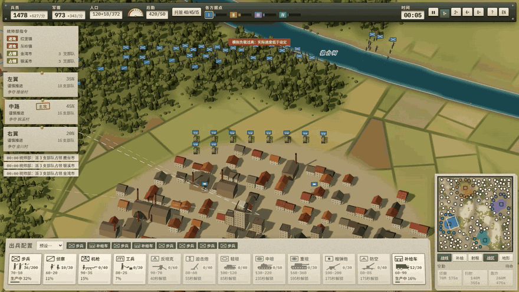
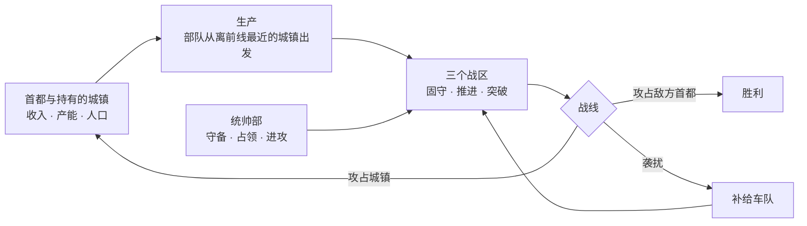
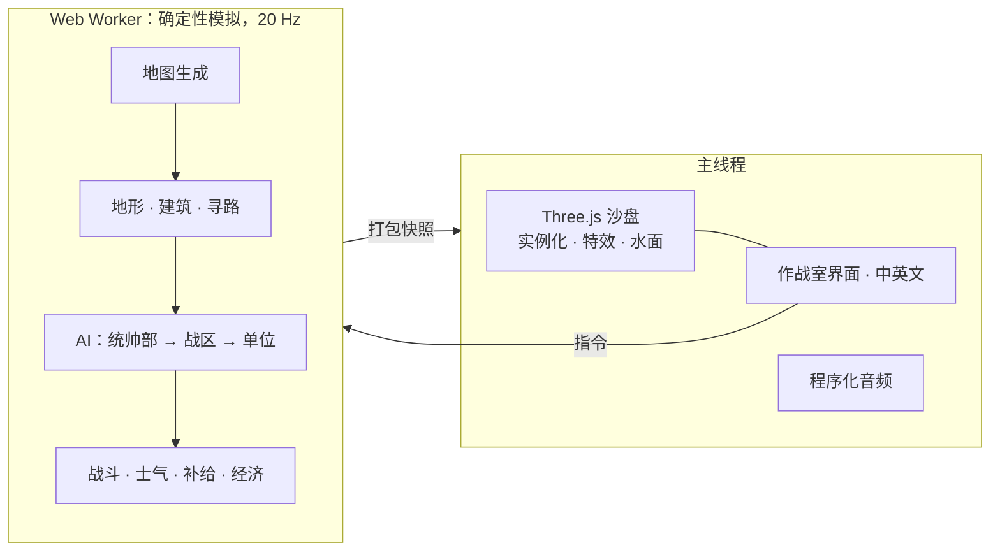

<div align="center">

[English](README.md) · **简体中文**


# LITTLE WAR · 小小战争

**二战即时战斗沙盘。** 统筹一国的战争资源，然后看成千上万的士兵在程序生成的地图上沿着真实战线作战：河流、山口、村庄、城镇与城市，每一处都值得争夺。

[](https://github.com/Zwl20085/LittleWarGame/releases/latest)
&nbsp;
[](https://github.com/Zwl20085/LittleWarGame/releases)


[特色](#特色) · [下载](#下载与运行) · [一场战争怎么打](#一场战争怎么打) · [操作](#操作) · [技术实现](#技术实现) · [从源码构建](#从源码构建)

</div>

---

## 特色

<table>
  <tr>
    <td width="50%"></td>
    <td width="50%"></td>
  </tr>
  <tr>
    <td><b>看得见的炮兵。</b>迫击炮和榴弹炮弹沿真实弹道越过山脊和屋顶，拖着发光尾迹，在墙面或田野上爆炸。开火的炮兵会被敌方声测定位，几轮齐射后必须转移阵地。</td>
    <td><b>真实战线，而不是兵线。</b>控制区由部队实际位置计算。各战区占据有利地形、局部优势时推进，并从薄弱处发起装甲突破。坦克足够坚固，可以担任进攻矛头，而反坦克炮是它们的克星。</td>
  </tr>
  <tr>
    <td></td>
    <td></td>
  </tr>
  <tr>
    <td><b>城镇是实体，值得死守。</b>每栋建筑都有碰撞体积：部队沿街道行进，墙体会阻挡视线、直射火力和炮弹。每个城镇都提供收入、产能与人口，因此全局<i>统帅部</i>会为受威胁的城镇派驻守备，并派小队占领空置据点。</td>
    <td><b>河流塑造战争。</b>河流沿谷地蜿蜒，有桥梁和浅滩。部队在渡口前集结、强渡；若最近的渡口绕路太远，工兵会架设浮桥。</td>
  </tr>
  <tr>
    <td></td>
    <td></td>
  </tr>
  <tr>
    <td><b>每张地图都是新的。</b>每个种子都会生成一张大地图（四方对战约 3.6 公里见方），包含带山口的山脉、谷地河流、森林、田野、上百个村庄、街区式城镇、带高楼的城市，以及每方一座首都。</td>
    <td><b>看得见、也打得断的补给。</b>补给车从补给站（首都与持有的城镇，距首都越远效率越低）往前线运送弹药。渗透部队穿过敌线薄弱处伏击车队，后方警戒部队负责清剿。</td>
  </tr>
</table>

### 作战方式、围城与作战倾向


每个战区进攻时都有一套**作战方式**，会以作战室风格的箭头画在地图上。AI 会依据兵力构成、目标和作战倾向自动选择，你也可以为每个战区手动锁定：

| 作战方式 | 部队行动 |
|---|---|
| **正面推进** | 全线稳步推进。 |
| **侧面迂回** | 机动部队（坦克、摩托化步兵、侦察）绕到较弱一侧的集结点，完成集结后从侧面突击；正面部队负责牵制。 |
| **钳形攻势** | 左右两翼同时迂回，合围同一目标。 |
| **武装渗透** | 小股步兵从敌线最薄弱处渗透，直取目标。 |
| **筑垒围攻** | 针对有守军的城镇：在直射距离外合围并挖掘堑壕，待守军被消耗后发起总攻。 |

<table>
  <tr>
    <td width="50%"></td>
    <td width="50%"></td>
  </tr>
  <tr>
    <td><b>野战工事。</b>围城方挖掘之字形堑壕，守军堆砌沙袋街垒。躲在完工工事后的部队，对来自正面的炮击和火力享有最好的掩护，任何一方都无法单靠炮兵把对方轰出地图。构筑工事消耗兵员。</td>
    <td><b>摩托化步兵。</b>长途安全行军时乘卡车机动，接近敌人、遭到射击或到达目的地时下车作战。适合迂回和快速占点，但乘车时较为脆弱。</td>
  </tr>
</table>

**作战倾向。**开战前可选择*均衡*、*步兵优先*、*装甲优先*、*机动优先*或*炮兵优先*。作战倾向决定你的生产配比，以及各战区偏好的作战方式；每个 AI 阵营也各有自己的作战倾向。

<div align="center">

<br/><sub>作战室界面。左上：统帅部指令（守备 / 进攻 / 占领）；其下：三个战区与战报；底部：生产栏；右下：小地图。默认中文，一键切换英文。</sub>
</div>

此外还有：
- **领土就是经济。**仅靠首都只能维持约三分之一的满编部队。村庄提供兵源（兵员），城镇和城市提供工业（军需）、生产位与人口，动员与工业配比会影响全部领土的产出；丢失领土会削弱战争能力，损失的部队需要时间和资金才能补充。
- **成千上万的士兵。**数百个战术单位（步兵班、火炮、坦克、卡车），采用实例化渲染。各班队形不一，远景时用部队标记保持画面清晰。
- **程序化音乐与音效。**自适应管弦配乐随战况起伏，还有步枪齐射、机枪点射、火炮、炮弹呼啸与飞机。全部实时合成，没有任何音频文件。
- **规则先行。**装甲朝向与穿深、高爆杀伤、掩体、压制、士气、受地形和建筑遮挡的视线，以及空袭与防空，都依照成文的数值规范实现。

## 下载与运行

| | |
|---|---|
| **Windows（推荐）** | 从 **[Releases](https://github.com/Zwl20085/LittleWarGame/releases/latest)** 下载。`LittleWar-<版本>-portable.exe` 是单文件，无需安装；`LittleWar-<版本>-setup.exe` 是安装版，带开始菜单与桌面快捷方式。 |
| **任意系统，从源码运行** | `npm install` 后执行 `npm run dev`，打开 http://localhost:5173；或用 `npm run app` 以桌面窗口运行。 |

> [!NOTE]
> Windows 版尚未进行代码签名，首次启动时 SmartScreen 可能会拦截，请选择**更多信息 → 仍要运行**。需要支持 WebGL2 的显卡（近 8 年内的显卡基本都可以）。按 **F11** 切换全屏。

## 一场战争怎么打



1. **动员。**首都和持有的城镇按底部生产栏的权重出兵。资源管家会自动平衡动员、工业与后勤，你也可以手动设定。
2. **指挥。**部队编入三个战区。你可以设定战区姿态（谨慎 / 强攻 / 固守 / 筑垒 / 撤退）或目标，其余交给 AI：依托河流设防、渡河前集结、推进、突破。统帅部负责为己方城镇派驻守备。
3. **争夺土地。**地图上百余个据点都可以占领。每占下一处，都会充实自己的经济，同时削弱敌方的经济。
4. **获胜。**只有**首都**被敌方步兵攻占，一方才会被淘汰。没有意志值，也**不设时间上限**：丢掉半壁江山，仍可反攻。

## 操作

| 输入 | 作用 |
|---|---|
| 左键单击 / 框选 | 选择部队（Shift 追加） |
| 右键地面 / 敌人 | 移动 / 集火 |
| <kbd>A</kbd> <kbd>H</kbd> <kbd>R</kbd> <kbd>G</kbd> | 攻击移动 · 原地坚守 · 撤退 · 恢复自动 |
| <kbd>W</kbd><kbd>A</kbd><kbd>S</kbd><kbd>D</kbd> 或中键拖动，<kbd>Q</kbd>/<kbd>E</kbd>，滚轮 | 平移 · 旋转 · 缩放 |
| <kbd>Ctrl</kbd>+滚轮 或 <kbd>PgUp</kbd>/<kbd>PgDn</kbd>，<kbd>Tab</kbd> | 镜头俯仰 · 全局视图 |
| <kbd>1</kbd> <kbd>2</kbd> <kbd>3</kbd> | 战区面板（姿态、目标、兵力分配） |
| <kbd>空格</kbd> <kbd>U</kbd> <kbd>Esc</kbd> | 暂停 · 隐藏界面 · 菜单 |
| <kbd>F11</kbd> · <kbd>Ctrl</kbd>+<kbd>Shift</kbd>+<kbd>I</kbd> | 全屏 · 开发者控制台（桌面版） |

游戏速度：1× / 2× / 4× / 8×。如果模拟跟不上，游戏会降速并给出提示，绝不跳帧。

## 技术实现



- **确定性模拟。**固定 20 Hz 步进与带种子的随机数：同一种子加同样的指令，会得到同一场战争，有测试专门检查这一点。模拟运行在 Web Worker 中，主线程只负责绘制。
- **面向数据的热点代码。**惰性流场（Dial 算法）按目标共享；按格排序的空间哈希负责邻近查询；2 米建筑栅格加局部绕行负责城镇内的移动。500 多个单位时，每帧模拟约 2–4 毫秒。
- **可检视的数值。**`scripts/balance.ts` 在无界面状态下运行 AI 对战，按兵种输出统计账本，数值调整都以它为依据。

<details>
<summary><b>数值账本示例</b>（2 个种子 × 25 分钟，4 方 AI）</summary>

```
type            built  lost  K/D   kills  dmgOut  dmgIn  dmg/min/unit  value-kill/spent  share
infantry          687   362  1.09    393    284k   407k         24.4             0.61  40.5%
light_tank        104    30  4.23    127    128k    55k         96.0             0.55  18.3%
medium_tank        56     3 31.00     93     94k    27k        144.9             0.51  13.4%
recon             272   306  0.25     78     76k   159k         28.6             0.31  10.9%
howitzer           94     0     -     12     34k   3.9k         27.1             0.05   4.9%
at_gun             57    16  1.56     25     23k   8.8k         34.2             0.47   3.2%
```

此外还会输出攻击方 × 受害方击杀矩阵，以及每 5 分钟一次的经济时间线：各方的部队数、人口与上限、持有据点、收入与库存。
</details>

## 从源码构建

需要 Node.js 18+。

```bash
npm install
npm run dev          # 浏览器：http://localhost:5173
npm run app          # 桌面窗口（Electron）
npm run dist:win     # 构建 Windows 单文件版 + 安装版 → release/
```

<details>
<summary><b>开发命令</b></summary>

```bash
npm test                                          # 单元、规则、地图与 AI 冒烟测试（vitest）
npm run typecheck
LONGRUN=1 npx vitest run tests/longrun.test.ts    # 完整时长的 AI 对战
npx tsx scripts/balance.ts 25 7,11                # 数值分析账本（分钟数，种子）
npx tsx scripts/perf.ts generated 600 7           # 每帧耗时、卡住的单位、补给状况
node scripts/capture.mjs                          # 录制战斗片段 → media/clips
node scripts/capture-page.mjs hero hud --lang zh  # 录制标题 / 界面片段 → media/page
```

URL 快捷方式：`?quick`（手工四方地图）、`?quick&map=gen&seed=42`、`?quick&map=1v1`、`&fog`、`&spectate`。

宣传片：`cd trailer && npm i && npx remotion studio` 预览，`npx remotion render src/index.ts Trailer ../media/trailer.mp4` 导出。
</details>

<details>
<summary><b>目录结构</b></summary>

```
src/sim/      确定性模拟：地图生成、地形与建筑、寻路、经济、生产、战斗、士气、
              补给车队、战线分析、AI（统帅部 / 城市 / 战区 / 单位）、统计账本
src/render/   Three.js 沙盘：实例化单位、地形、水面、聚落、炮兵特效
src/ui/       作战室界面、标题界面、统帅部卡片、中英文
src/audio/    程序化音乐与音效（Web Audio）
electron/     桌面版外壳（通过 app:// 加载构建产物）
docs/         策划文档与 docs/data/*.csv|json（兵种、武器与规则数据）
tests/        规则、地形、地图生成、确定性与 AI 冒烟测试
trailer/      宣传片的 Remotion 工程
```

策划文档入口：[docs/README.md](docs/README.md)。实现阶段的决定见 `docs/GAME_DESIGN.md` §2.1.1。
</details>

## 状态

原型 **v0.5**。数值依据无界面的 AI 对战调校，尚未经过真人试玩。计划中：存档 / 读档与回放、反坦克障碍与战壕、同盟（数据模型已支持），以及内置字体以便完全离线运行。

## 许可

MIT，见 [LICENSE](LICENSE)。宣传片使用 [Remotion](https://www.remotion.dev/) 制作，个人及 3 人以内团队可免费使用。
