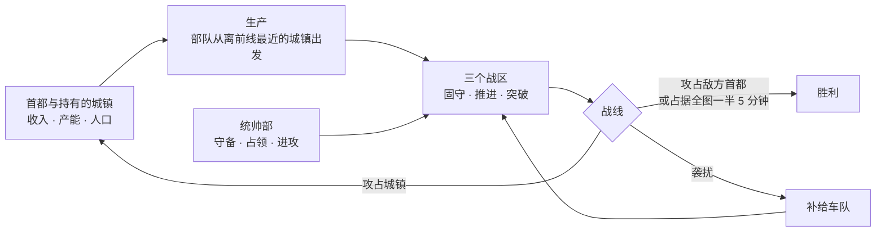
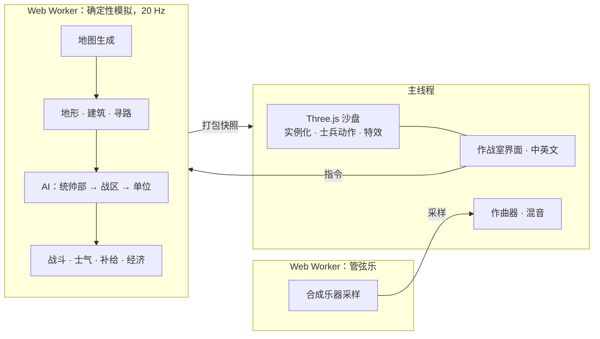

<div align="center">

[English](README.md) · **简体中文**


# LITTLE WAR · 小小战争

**二战即时战斗沙盘。** 统筹一国的战争资源，然后看成千上万的士兵在程序生成的地图上沿着真实战线作战：河流、山口、村庄、城镇与城市，每一处都值得争夺。

[](https://github.com/Zwl20085/LittleWarGame/releases/latest)
&nbsp;
[](https://github.com/Zwl20085/LittleWarGame/releases)


[1.1 新内容](#11-新内容) · [特色](#特色) · [下载](#下载与运行) · [一场战争怎么打](#一场战争怎么打) · [操作](#操作) · [技术实现](#技术实现) · [从源码构建](#从源码构建)

</div>

---

## 1.1 新内容

- **更强的炮兵。**迫击炮和榴弹炮会对移动目标打提前量，炮弹也不再炸在自家炮位上。炮弹威力和爆炸范围都更大（榴弹 180 伤害、半径 16 米，迫击炮弹 125 伤害、半径 11 米），两门炮几轮齐射就能打垮一个暴露在开阔地的步兵班。榴弹炮数量上限降低、造价下调，炮兵击杀约占总数的五分之一。
- **兵种身份核对。**逐一核对每个兵种的伤害与生命值是否符合名字给人的印象。重型坦克主炮伤害 150 → 210，平衡规格文档与数据表重新一致。
- **统帅部保卫首都。**统帅部会预判首都受到的威胁：敌方部队是否以首都为目标、是否正在逼近。威胁成立时，它召回离得最近、交战最少的战区（至少保留一个继续进攻），派出守备队，并在来敌方向挖掘环形堑壕和沙袋工事。统帅部卡片会显示 **首都受威胁** 一栏和预计接敌时间。策略实验室中，本可挡住的进攻导致的首都失守从 7 次降到 0 次（6 个种子 × 45 分钟）。
- **围城与总攻。**面对设防的首都，部队不再一味派矛头硬冲，而是合围、把所有火炮推进到射程内，兵力足够时发起总攻，攻势受挫就就地挖壕。回防召回也不会再打断正在进行的突击。
- **炮组部署到交火处。**机枪和反坦克炮会前往战线上真正接敌的地段，开火次数约增加一倍。
- **征服胜利与按领土计算的人口上限。**一方占据全图一半的居民点并保持 5 分钟即获胜；占比一跌破一半，倒计时立即中断。人口上限随所占领土增长，控制大半地图的一方能组建比最后的守方更庞大的军队。
- **再次提速。**快照应用耗时减半，热点空间查询复用缓冲区，植被与据点分块加大后场景对象减少约四分之一；各个视角下模拟都能维持 8 倍速（[docs/PERFORMANCE.md](docs/PERFORMANCE.md)）。

<details>
<summary><b>1.0 新内容</b></summary>

- **士兵像人一样行动。**每名士兵以有限的步速走向自己在队形中的位置，逐渐转身，步幅随实际走过的距离变化。行军纵队沿弯道依次转向，而不是整队像一块板一样旋转；火炮转向时，炮组成员会绕着火炮走动。
- **地形与建筑参与战斗。**步兵班可以驻守房屋、从窗口射击，直到高爆弹把房屋打塌。高地射得更准、看得更远，山脊能掩护守军，林中不开火的部队难以被发现，渡口和桥上的部队无处隐蔽。AI 会据守城镇边缘与山脊。
- **管弦配乐。**按战况强弱切换主题，有紧张渐强、战斗固定音型、挽歌，以及胜利与失败的短乐句。配乐逐小节实时作曲，由游戏启动时在 Worker 中合成的管弦乐采样演奏。
- **更聪明的 AI。**作战方式的选择规则依据"策略实验室"的实测结果重新调整，该实验室记录每一次作战：作战成功率从 42% 提高到 58%。占优势的一方会集中各战区进攻敌方首都，战争因此能够分出胜负。
- **更快。**8 倍速下约 500 个单位也能跟上。约 460 个单位时，模拟每步平均耗时从 4.5 毫秒降到 2.7 毫秒。据点标记改为实例化渲染；新增**画质**设置（自动 / 高 / 中 / 低），自动模式会在帧率偏低时降档。

</details>

## 特色

<table>
  <tr>
    <td width="50%"></td>
    <td width="50%"></td>
  </tr>
  <tr>
    <td><b>看得见的炮兵。</b>迫击炮和榴弹炮弹沿真实弹道越过山脊和屋顶，拖着发光尾迹，在墙面或田野上爆炸。炮手会对移动目标打提前量，一发炮弹就能把暴露在开阔地的步兵班炸散。开火的炮兵会被敌方声测定位，几轮齐射后必须转移阵地。</td>
    <td><b>真实战线，而不是兵线。</b>控制区由部队实际位置计算。各战区占据有利地形、局部优势时推进，并从薄弱处发起装甲突破。坦克足够坚固，可以担任进攻矛头，而反坦克炮是它们的克星。</td>
  </tr>
  <tr>
    <td></td>
    <td></td>
  </tr>
  <tr>
    <td><b>城镇是实体，值得死守。</b>每栋建筑都有碰撞体积：部队沿街道行进，墙体会阻挡视线、直射火力和炮弹。每个城镇都提供收入、产能与人口，因此全局<i>统帅部</i>会为受威胁的城镇派驻守备，并派小队占领空置据点。</td>
    <td><b>河流塑造战争。</b>河流沿谷地蜿蜒，有桥梁和浅滩。部队在渡口前集结、强渡；若最近的渡口绕路太远，工兵会架设浮桥。</td>
  </tr>
  <tr>
    <td></td>
    <td></td>
  </tr>
  <tr>
    <td><b>每张地图都是新的。</b>每个种子都会生成一张大地图（四方对战约 3.6 公里见方），包含带山口的山脉、谷地河流、森林、田野、上百个村庄、街区式城镇、带高楼的城市，以及每方一座首都。</td>
    <td><b>看得见、也打得断的补给。</b>补给车从补给站（首都与持有的城镇，距首都越远效率越低）往前线运送弹药。渗透部队穿过敌线薄弱处伏击车队，后方警戒部队负责清剿。</td>
  </tr>
  <tr>
    <td></td>
    <td></td>
  </tr>
  <tr>
    <td><b>是士兵，不是棋子。</b>每名士兵以步行速度走向自己在队形中的位置，逐渐转身，步幅随走过的距离变化，脚下不会打滑。在道路上，步兵班以单列或纵队行军，沿领头者的路线依次转过弯道。火炮转向时，炮组成员绕着火炮走动。</td>
    <td><b>地形与建筑参与战斗。</b>步兵班躲在房屋背敌一侧、从窗口射击，在这一侧获得重掩护，直到高爆弹把房屋打塌。教堂与塔楼可作观察哨。在林中不开火的部队只有靠近才会被发现。占据高地射击更准、炮兵观测更精确，山脊能让守军躲过来自坡下的火力。渡口与桥上的部队无处隐蔽。AI 布防时会选择城镇和林地朝敌的边缘、山脊与建筑背面。</td>
  </tr>
</table>

### 作战方式、围城与作战倾向


每个战区进攻时都有一套**作战方式**，会以作战室风格的箭头画在地图上。AI 会依据兵力构成、目标和作战倾向自动选择，你也可以为每个战区手动锁定：

| 作战方式 | 部队行动 |
|---|---|
| **正面推进** | 全线稳步推进。 |
| **侧面迂回** | 机动部队（坦克、摩托化步兵、侦察）绕到较弱一侧的集结点，完成集结后从侧面突击；正面部队负责牵制。 |
| **钳形攻势** | 左右两翼同时迂回，合围同一目标。 |
| **武装渗透** | 小股步兵从敌线最薄弱处渗透，直取目标。 |
| **筑垒围攻** | 针对有守军的城镇：在直射距离外合围并挖掘堑壕，待守军被消耗后发起总攻。 |

<table>
  <tr>
    <td width="50%"></td>
    <td width="50%"></td>
  </tr>
  <tr>
    <td><b>野战工事。</b>围城方挖掘之字形堑壕，守军堆砌沙袋街垒。首都受到威胁时，会在来敌方向挖出一圈堑壕。躲在完工工事后的部队，对来自正面的炮击和火力享有最好的掩护，任何一方都无法单靠炮兵把对方轰出地图。构筑工事消耗兵员。</td>
    <td><b>摩托化步兵。</b>长途安全行军时乘卡车机动，接近敌人、遭到射击或到达目的地时下车作战。适合迂回和快速占点，但乘车时较为脆弱。</td>
  </tr>
</table>

**作战倾向。**开战前可选择*均衡*、*步兵优先*、*装甲优先*、*机动优先*或*炮兵优先*。作战倾向决定你的生产配比，以及各战区偏好的作战方式；每个 AI 阵营也各有自己的作战倾向。

<div align="center">

<br/><sub>作战室界面。左上：统帅部指令（守备 / 进攻 / 占领），此处最上面是 <i>首都受威胁</i> 一栏和预计接敌时间；其下：三个战区与战报；底部：生产栏；右下：小地图。默认中文，一键切换英文。</sub>
</div>

此外还有：
- **领土就是经济。**仅靠首都只能维持约三分之一的满编部队。村庄提供兵源（兵员），城镇和城市提供工业（军需）、生产位与人口，动员与工业配比会影响全部领土的产出；丢失领土会削弱战争能力，损失的部队需要时间和资金才能补充。
- **成千上万的士兵。**数百个战术单位（步兵班、火炮、坦克、卡车），采用实例化渲染。步兵班的队形随情况变化（道路上成单列，行进中成楔形或分组，交火时成散兵线），远景时用部队标记保持画面清晰。
- **管弦配乐。**音乐跟随战况：平静的主旋律，战斗逼近时的紧张主题，激战中的战斗固定音型，丢失领土时的挽歌，以及胜利、失败与敌方首都陷落时的短乐句。作曲器以 8 小节乐句逐小节写作，带声部进行的和声与按种子变化的配器，由在 Worker 中合成的弦乐、圆号、铜管、木管、定音鼓与小军鼓演奏。步枪齐射、机枪点射、火炮与炮弹呼啸同样是合成的，游戏不带任何音频文件；`npx vite-node scripts/music-preview.ts` 可以把配乐渲染成 WAV 文件离线试听。
- **规则先行。**装甲朝向与穿深、高爆杀伤、掩体、压制、士气以及受地形和建筑遮挡的视线，都依照成文的数值规范实现。

## 下载与运行

| | |
|---|---|
| **Windows（推荐）** | 从 **[Releases](https://github.com/Zwl20085/LittleWarGame/releases/latest)** 下载。`LittleWar-<版本>-portable.exe` 是单文件，无需安装；`LittleWar-<版本>-setup.exe` 是安装版，带开始菜单与桌面快捷方式。 |
| **任意系统，从源码运行** | `npm install` 后执行 `npm run dev`，打开 http://localhost:5173；或用 `npm run app` 以桌面窗口运行。 |

> [!NOTE]
> Windows 版尚未进行代码签名，首次启动时 SmartScreen 可能会拦截，请选择**更多信息 → 仍要运行**。需要支持 WebGL2 的显卡（近 8 年内的显卡基本都可以）。按 **F11** 切换全屏。

## 一场战争怎么打



1. **动员。**首都和持有的城镇按底部生产栏的权重出兵。资源管家会自动平衡动员、工业与后勤，你也可以手动设定。
2. **指挥。**部队编入三个战区。你可以设定战区姿态（谨慎 / 强攻 / 固守 / 筑垒 / 撤退）或目标，其余交给 AI：依托河流设防、渡河前集结、推进、突破。统帅部负责为己方城镇派驻守备。
3. **争夺土地。**地图上百余个据点都可以占领。每占下一处，都会充实自己的经济，同时削弱敌方的经济。
4. **获胜。****首都**被敌方步兵攻占的一方即被淘汰。一方若占据全图一半的居民点并保持 5 分钟，即取得**征服胜利**；占比一跌破一半，倒计时立即中断。没有意志值，也**不设时间上限**：丢掉半壁江山，仍可反攻。一旦某一方占据优势，它的统帅部会让所有战区转向最弱、最近的敌方首都；首都若已设防，就转为围城。

## 操作

| 输入 | 作用 |
|---|---|
| 左键单击 / 框选 | 选择部队（Shift 追加） |
| 右键地面 / 敌人 | 移动 / 集火 |
| <kbd>A</kbd> <kbd>H</kbd> <kbd>R</kbd> <kbd>G</kbd> | 攻击移动 · 原地坚守 · 撤退 · 恢复自动 |
| <kbd>W</kbd><kbd>A</kbd><kbd>S</kbd><kbd>D</kbd> 或中键拖动，<kbd>Q</kbd>/<kbd>E</kbd>，滚轮 | 平移 · 旋转 · 缩放 |
| <kbd>Ctrl</kbd>+滚轮 或 <kbd>PgUp</kbd>/<kbd>PgDn</kbd>，<kbd>Tab</kbd> | 镜头俯仰 · 全局视图 |
| <kbd>1</kbd> <kbd>2</kbd> <kbd>3</kbd> | 战区面板（姿态、目标、兵力分配） |
| <kbd>空格</kbd> <kbd>U</kbd> <kbd>Esc</kbd> | 暂停 · 隐藏界面 · 菜单 |
| <kbd>F11</kbd> · <kbd>Ctrl</kbd>+<kbd>Shift</kbd>+<kbd>I</kbd> | 全屏 · 开发者控制台（桌面版） |

游戏速度：1× / 2× / 4× / 8×。如果模拟跟不上，游戏会降速并给出提示，绝不跳帧。

**画质**（标题界面或 Esc 菜单中的设置）：*自动*（默认）、*高*、*中*、*低*。自动模式在约 3 秒帧率偏低后降一档，并给出提示。

## 技术实现



- **确定性模拟。**固定 20 Hz 步进与带种子的随机数：同一种子加同样的指令，会得到同一场战争，有测试专门检查这一点。模拟运行在 Web Worker 中，主线程只负责绘制。
- **面向数据的热点代码。**惰性流场（Dial 算法）按目标共享，路径按 320 米分段生成；按格排序的空间哈希负责邻近查询；2 米建筑栅格加局部绕行负责城镇内的移动。1.0 的性能优化把约 460 个单位时的平均每步耗时从 4.5 毫秒降到 2.7 毫秒。1.1 的优化把快照应用从 1.06 毫秒降到 0.54 毫秒，无界面运行时约 330 个单位的平均每步耗时为 1.6 毫秒；在开发机上，全图、前线和近景视角下模拟都能维持 8 倍速（[docs/PERFORMANCE.md](docs/PERFORMANCE.md)）。
- **渲染预算。**据点标记由约 600 个网格合并为 4 个实例化网格，植被与据点分块加大后场景约剩 500 个对象；地图标签使用缓存的贴图绘制。每名士兵只是扁平数组中的几个浮点数，每帧步进，没有单独的场景对象。画质档位决定阴影贴图、像素比与地表点缀。
- **可检视的数值。**数值和 AI 的改动在发布前都要经过无界面的 AI 对战检验：
  - `scripts/balance.ts` 按兵种输出统计账本、击杀矩阵与经济时间线。
  - **数值实验室**（`scripts/lab.ts`）在同一批种子上做带数据覆盖的 A/B 实验，按验收带检查满员度、囤积、损耗与领土易手（[docs/BALANCE_LAB.md](docs/BALANCE_LAB.md)）。
  - **策略实验室**（`scripts/strategy.ts`）记录每一次作战、交战与占领，统计不同兵力比与地形下哪种作战方式有效（[docs/STRATEGY_LAB.md](docs/STRATEGY_LAB.md)，英文）。调整作战方式规则后，作战成功率从 42% 升到 58%，每局占领数增加 17%（8 个种子 × 20 分钟）。1.1 的两轮实验中（6 个种子 × 45 分钟），首都防御让本可挡住的首都失守从 7 次降到 0 次；围城总攻与新的炮组部署让作战成功率从 38.9% 升到 42.3%，机枪开火占比翻倍。
  - **长时测试**（`scripts/soak.ts`）完整跑完整场战争，标出 NaN、卡住的单位、闲置的战区与过慢的步进。

<details>
<summary><b>数值账本示例</b>（<code>npx tsx scripts/balance.ts 15 7</code>：1 个种子 × 15 分钟，4 方 AI）</summary>

```
== Operations launched / won ==
flank 24  frontal 21  infiltrate 10  pincer 9  siege 21  won:flank 4

type            built  lost  K/D   kills  dmgOut  dmgIn  dmg/min/unit  value-kill/spent  dmg/cost  share
infantry          102    72  0.79     57     49k    72k         18.9             0.60      6.00  44.5%
light_tank         32     5  3.40     17     19k   8.5k         88.5             0.25      2.72  17.4%
howitzer           31     3  4.67     14     15k   2.0k         97.9             0.19      1.75  13.3%
medium_tank        17     0     -     11     11k   1.4k        147.4             0.21      1.77   9.6%
recon              56    35  0.23      8    8.6k    21k         10.3             0.14      1.93   7.8%
mg                  8     2  4.00      8    5.3k    919         58.7             0.64      5.28   4.8%
```

此外还会输出攻击方 × 受害方击杀矩阵、各兵种所受伤害的来源占比，以及每 5 分钟一次的经济时间线：各方的部队数、人口与上限、持有据点、收入与库存。
</details>

## 从源码构建

需要 Node.js 18+。

```bash
npm install
npm run dev          # 浏览器：http://localhost:5173
npm run app          # 桌面窗口（Electron）
npm run dist:win     # 构建 Windows 单文件版 + 安装版 → release/
```

<details>
<summary><b>开发命令</b></summary>

```bash
npm test                                          # 单元、规则、地图与 AI 冒烟测试（vitest）
npm run typecheck
LONGRUN=1 npx vitest run tests/longrun.test.ts    # 完整时长的 AI 对战

# 数值与 AI
npx tsx scripts/balance.ts 15 7                   # 兵种账本、击杀矩阵、经济（分钟数，种子）
npx tsx scripts/lab.ts --seeds 7,11 --minutes 30 --ab --set unit.infantry.cost_p=90  # 数值实验室 A/B
npx tsx scripts/strategy.ts --seeds 7,11,13 --minutes 20 --compare  # 策略实验室：作战结果、A/B
npx tsx scripts/soak.ts 45 7,11,13                # 完整战争：结局、异常、步进耗时（分钟数，种子）

# 性能
npx tsx scripts/perf.ts generated 600 7           # 无界面每步耗时（均值、p99）、卡住的单位、补给状况
node scripts/profile.mjs                          # 同一局的 V8 CPU 剖析，最耗时的函数
node scripts/perf-browser.mjs                     # 无头 Edge 中以 8 倍速运行真实游戏：帧率、渲染各阶段

# 媒体
npx vite-node scripts/music-preview.ts            # 把配乐各场景渲染为 WAV → media/stats/music
node scripts/capture.mjs                          # 录制战斗片段 → media/clips
node scripts/capture-page.mjs hero hud --lang zh  # 录制标题 / 界面片段 → media/page
```

URL 快捷方式：`?quick`（手工四方地图）、`?quick&map=gen&seed=42`、`?quick&map=1v1`、`&fog`、`&spectate`。

宣传片：`cd trailer && npm i && npx remotion studio` 预览，`npx remotion render src/index.ts Trailer ../media/trailer.mp4` 导出。
</details>

<details>
<summary><b>目录结构</b></summary>

```
src/sim/      确定性模拟：地图生成、地形与建筑、寻路、经济、生产、战斗、士气、
              补给车队、战线分析、AI（统帅部 / 城市 / 战区 / 单位）、统计账本
src/render/   Three.js 沙盘：实例化单位、士兵动作、地形、水面、聚落、炮兵特效、画质档位
src/ui/       作战室界面、标题界面、统帅部卡片、设置、中英文
src/audio/    作曲器与主题、合成管弦乐（Worker）、音效（Web Audio）
scripts/      数值与策略实验室、长时测试、性能与剖析工具、录制脚本
electron/     桌面版外壳（通过 app:// 加载构建产物）
docs/         策划文档与 docs/data/*.csv|json（兵种、武器与规则数据）
tests/        规则、地形、地图生成、确定性与 AI 冒烟测试
trailer/      宣传片的 Remotion 工程
```

策划文档入口：[docs/README.md](docs/README.md)。实现阶段的决定见 `docs/GAME_DESIGN.md` §2.1.1。
</details>

## 状态

**v1.1。**数值与 AI 依据无界面的 AI 对战调校，真人试玩还不多。计划中：存档 / 读档与回放、反坦克障碍与雷场、同盟（数据模型已支持），以及内置字体以便完全离线运行。

**已知限制：**管弦乐是合成的而非录音，听起来也像合成乐器；只有单人模式，没有多人对战；Windows 版没有代码签名。

## 许可

MIT，见 [LICENSE](LICENSE)。宣传片使用 [Remotion](https://www.remotion.dev/) 制作，个人及 3 人以内团队可免费使用。
