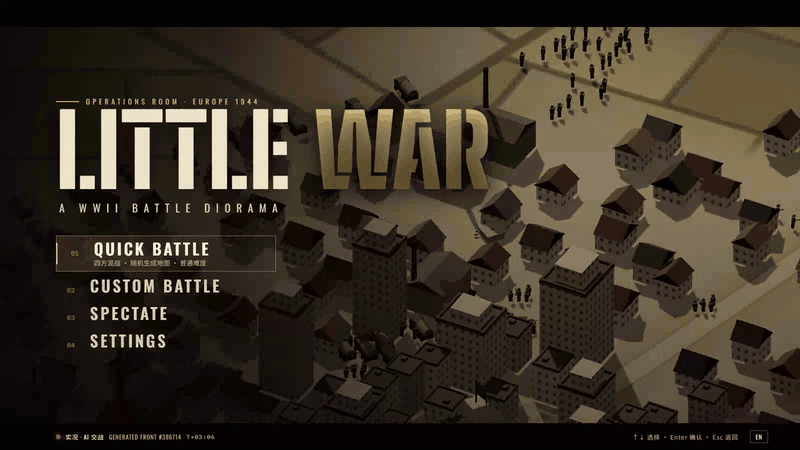
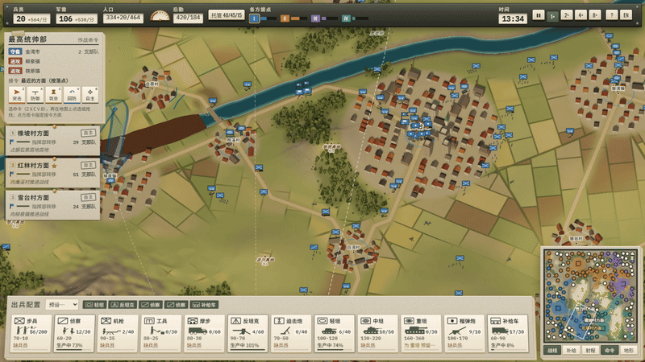
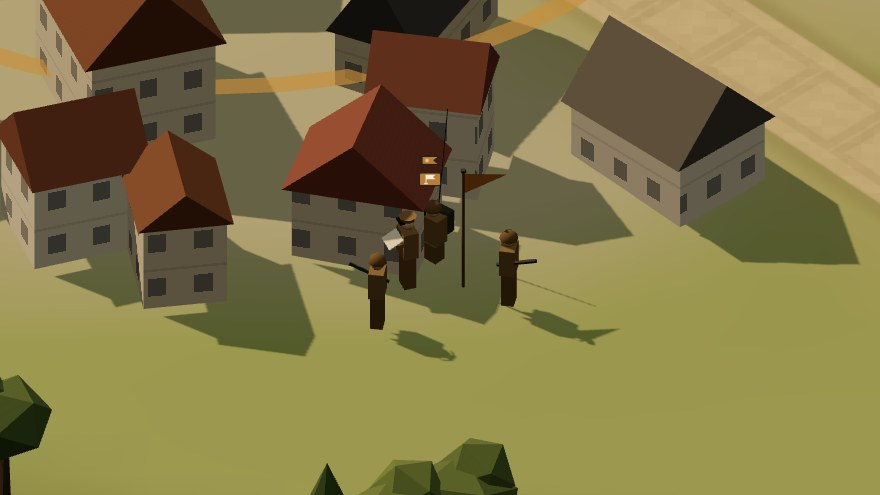
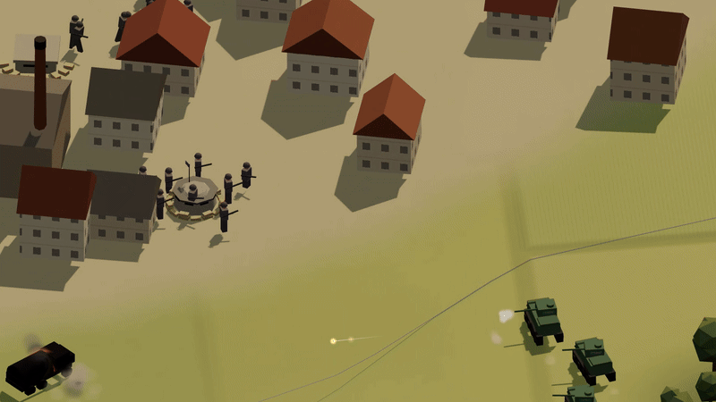
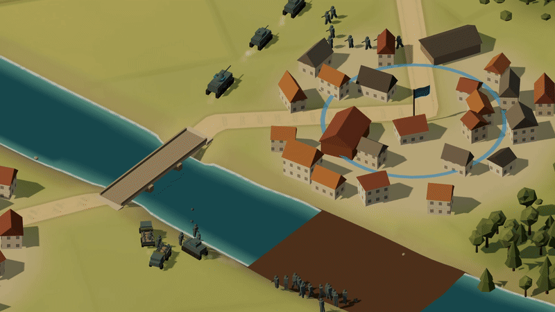
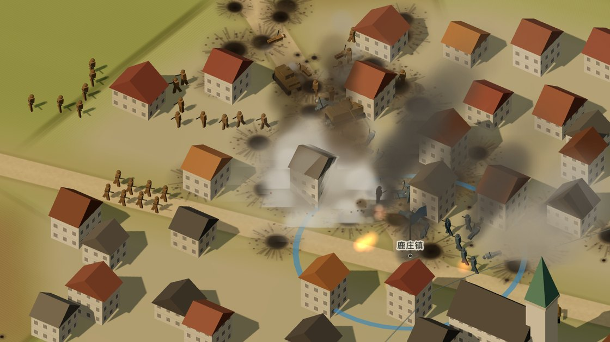
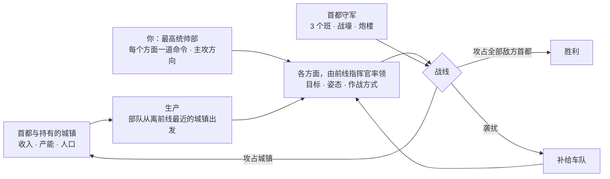
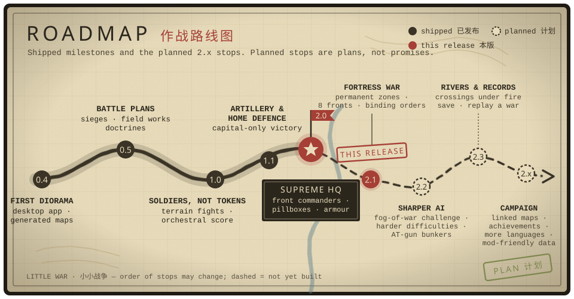

<div align="center">

[English](README.md) · **简体中文**



# LITTLE WAR · 小小战争

**二战即时战斗沙盘。** 统筹一国的战争资源，然后看成千上万的士兵在程序生成的地图上沿着真实战线作战：河流、山口、村庄、城镇与城市，每一处都值得争夺。

[](https://github.com/Zwl20085/LittleWarGame/releases/latest)
&nbsp;
[](https://github.com/Zwl20085/LittleWarGame/releases)


[2.0 新内容](#20-新内容) · [特色](#特色) · [下载](#下载与运行) · [一场战争怎么打](#一场战争怎么打) · [操作](#操作) · [技术实现](#技术实现) · [路线图](#路线图) · [从源码构建](#从源码构建)

</div>

---

## 2.1 新内容

- **筑垒地域是永备工事。**一次筑垒命令就登记一个筑垒地域；之后给同一方面下达新命令不会取消它。统帅部卡片上的**筑垒地域**列表显示进度、驻守方面并可取消；地域作为模板线留在地图上，任何方面的工兵都会去完工。
- **方面数量不再受限于三个。**按 <kbd>N</kbd> 再点地图即可开设新方面（最多 8 个；指挥官花费 120 兵员，350 米内的空闲部队并入），在卡片上可撤销方面，<kbd>1</kbd>–<kbd>8</kbd> 选择方面。AI 同样最多 8 个方面，并为建成的筑垒地域开设守备方面。
- **命令是强约束。**接到你命令的方面不再外派占领、袭扰、警戒分队；突击命令不会因"敌强我弱"而停下；防御与筑垒命令让全体部队留在防线上，并优先进入工事。卡片印上**奉命**印章，展开后显示到位人数。
- **工事更划算。**炮楼 6 兵员 + 50 军需（2750 HP）自带 200 米机枪；堡垒 12 兵员 + 100 军需（5625 HP）并增强驻军火力；堑壕更便宜。首都开局就有建成的炮楼与随军工兵，工事待工时统帅部自动补充工兵。soak 测试中，工事驻守从每方 2 个班提高到全部位置的 66—93%。
- **生产顾及需求。**有工地等待而无空闲工兵时自动排产工兵（玩家同样适用；暂停工兵生产线即可关闭）。
- **脚踏实地。**单位不再悬浮：按渲染地形表面取高（而非模拟的粗网格），车辆随坡度俯仰并侧倾，阴影从脚下开始（阴影偏移随阴影贴图像素尺寸变化），每个单位都有柔和的接触阴影；新增来自镜头一侧的补光，照亮玩家真正看到的那一面。
- **有街道的城镇。**街区网格直接绘入地形（石板路、路缘、排水沟、人行道），每座城镇都有带纪念柱或水井、摊位与长椅的广场；路灯、马车、院墙、教堂墓园、工厂货场与铁路支线、乡间电线杆、烟囱炊烟。房屋现在与街道对齐（修正了布局中长期存在的朝向错误）。
- **更精细的模型。**步兵背包、铺盖卷、水壶，班里有班长和轻机枪手；坦克有各自不同的行走装置、舱盖、炮盾、外挂物，重坦有炮口制退器；卡车、火炮与指挥部参谋组同样细化；建筑有窗洞、门、烟囱、瓦楞、尖塔与锯齿形厂房屋顶。全部实例化绘制：每帧最多增加 0.4 毫秒，8 倍速依然稳定。

<details>
<summary><b>2.0 新内容</b></summary>

## 2.0 新内容

- **你就是最高统帅部。**固定的左 / 中 / 右三路战区取消了。你指挥的是各个*方面*（战线），并在地图上给每个方面下达一道常设命令：**突击**、**防御**、**筑垒防守**、**回防**或**自主**。左键点选一个地点，按住拖动则画出一条战线。每道命令都会以作战地图上的墨线画出，并盖上写有方面名称的印章。远离所有方面的命令会开辟一个新方面（最多 4 个）。AI 最高统帅部同样会开辟、合并、撤销自己的方面，并通过与你相同的命令接口下达命令（[docs/COMMAND_V2.md](docs/COMMAND_V2.md)）。
- **前线指挥官。**每个方面都由地图上的一名指挥官率领：四人参谋组（看地图的军官、报务员、两名警卫）和一面指挥部三角旗，生命值 2400。指挥官驻扎在战线后方最近的、安全的己方城镇，在你的命令范围内自行选择目标、姿态、作战方式和战线位置。指挥官阵亡后，该方面只能原地固守约一分钟；90 秒后会任命继任者。
- **炮楼与堡垒。**工兵可以修建炮楼（10 兵员 + 80 军需，70 秒，2200 生命值，容纳一个班，内置机枪，后方有射击盲区）和堡垒（20 兵员 + 160 军需，120 秒，4500 生命值，容纳两个班或一门反坦克炮）。**筑垒防守**命令会沿你画的战线布设筑垒地域：战壕、两端各一座炮楼、中段后方一座堡垒。每座首都从开局最初几分钟起就有 3 个班的常驻守军，以及工兵修建的 2 道战壕和 2 座炮楼组成的防线。
- **装甲与摩托化突破。**拥有 3 辆以上空闲坦克或摩托化步兵班的方面，局部兵力优势达到 1.5 倍即可发动突破，每 75 秒一次，由装甲和摩步打头阵。参与突破的摩托化步兵在敌人进入 220 米之前一直乘车。中型坦克改为 2100 生命值、2.8 米/秒、主炮 130 伤害，轻型坦克速度 3.3 米/秒。坦克能敲开混凝土：重坦 4 发、中坦 7 发即可摧毁一座炮楼。反坦克炮仍是最好的坦克杀手：坦克损失中由它造成的比例从 13% 升到 21%（[数值文档 §2.7](docs/BALANCE_SPEC.md)）。
- **挑战实验室。**`scripts/challenge.ts` 让一方以预设脚本策略作战（3 / 5 / 10 分钟速攻、龟缩、双路进攻、袭扰、后期闪击、模拟真人、全军直扑首都），通过真实命令接口对抗另外三方 AI，并报告 AI 是否守住了首都、如何防守（[docs/CHALLENGE_LAB.md](docs/CHALLENGE_LAB.md)，英文）。
- **更有分量的火力。**爆炸效果取决于命中了什么：水花、倒塌建筑扬起的尘土与瓦砾、屋顶命中、穿甲弹火花、车辆殉爆。火炮喷出锥形炮口焰并带出烟圈，曳光弹更亮，残骸持续燃烧、火星逐渐熄灭，长时间遭炮击的地面笼罩着一层淡淡的硝烟（高画质档）。
- **依然很快。**敌距离变换改用更粗的网格（占模拟 CPU 从 2.8% 降到 0.8%），防御位置与掩体搜索结果被缓存，工事查找改用每步建立的索引。2.0 的统帅部规划每 5 秒运行一次，不增加每步开销。浏览器中，全图视角每帧渲染 4.8 毫秒，战斗视角 3.3—3.5 毫秒，8 倍速依然稳定。

</details>

<details>
<summary><b>1.1 与 1.0 新内容</b></summary>

**1.1**

- **更强的炮兵。**迫击炮和榴弹炮会对移动目标打提前量，炮弹也不再炸在自家炮位上。炮弹威力和爆炸范围都更大（榴弹 180 伤害、半径 16 米，迫击炮弹 125 伤害、半径 11 米），两门炮几轮齐射就能打垮一个暴露在开阔地的步兵班。榴弹炮数量上限降低、造价下调，炮兵击杀约占总数的五分之一。
- **兵种身份核对。**逐一核对每个兵种的伤害与生命值是否符合名字给人的印象。重型坦克主炮伤害 150 → 210，平衡规格文档与数据表重新一致。
- **统帅部保卫首都。**统帅部会预判首都受到的威胁，召回离得最近、交战最少的部队，派出守备队，并在来敌方向挖掘环形堑壕。策略实验室中，本可挡住的进攻导致的首都失守从 7 次降到 0 次（6 个种子 × 45 分钟）。
- **围城与总攻。**面对设防的首都，部队合围、把所有火炮推进到射程内，兵力足够时发起总攻，攻势受挫就就地挖壕。
- **炮组部署到交火处。**机枪和反坦克炮会前往战线上真正接敌的地段，开火次数约增加一倍。
- **按领土计算的人口上限。**人口上限随所控领土增长。胜利仍只有攻占全部敌方首都一种方式。
- **再次提速。**快照应用耗时减半，场景对象减少约四分之一（[docs/PERFORMANCE.md](docs/PERFORMANCE.md)）。

**1.0**

- **士兵像人一样行动。**每名士兵以有限的步速走向自己在队形中的位置，逐渐转身，步幅随实际走过的距离变化。
- **地形与建筑参与战斗。**步兵班可以驻守房屋、从窗口射击，直到高爆弹把房屋打塌。高地射得更准、看得更远，山脊能掩护守军，林中不开火的部队难以被发现。
- **管弦配乐**，逐小节实时作曲，由 Worker 中合成的管弦乐演奏。
- **更聪明的 AI。**依据策略实验室重新调整作战方式的选择规则，作战成功率从 42% 提高到 58%。
- **更快。**约 460 个单位时，模拟每步平均耗时从 4.5 毫秒降到 2.7 毫秒，并新增**画质**设置。

</details>

## 特色

<div align="center">

<br/><sub><b>最高统帅部命令。</b>先选命令（<kbd>Z</kbd> <kbd>X</kbd> <kbd>C</kbd> <kbd>V</kbd> <kbd>B</kbd>），再在地图上点选地点或拖出战线。这里一个方面接到防线命令，另一个方面接到突击命令。每道常设命令都画成一条带印章的墨线，前线指挥官自己的作战箭头画在下方。左上：最高统帅部卡片（命令栏）和每个方面一张卡片；底部：生产栏；右下：小地图。默认中文，一键切换英文。</sub>
</div>
<br/>

<table>
  <tr>
    <td width="50%"></td>
    <td width="50%"></td>
  </tr>
  <tr>
    <td><b>看得见的前线指挥官。</b>每名指挥官都是一个四人参谋组，竖着指挥部三角旗。指挥官驻扎在战线后方最近的安全己方城镇，只在自卫时开火，敌方武装部队靠近就后撤。在你的命令范围内，由它选择目标、姿态和作战方式，方面卡片会说明理由。指挥官阵亡后，该方面约一分钟内只守不攻；只要统帅部付得起，90 秒后就会任命继任者。</td>
    <td><b>炮楼、堡垒与筑垒地域。</b>由工兵修建，步兵班停在旁边就会进驻。炮楼里的班使用内置机枪，后方有射击盲区；堡垒可容纳两个班或一门反坦克炮。驻军在开火之前一直处于隐蔽状态。建筑不占人口。坦克能把它们敲开，但穿甲弹对混凝土的伤害有上限，所以反坦克炮仍然是用来打坦克的。</td>
  </tr>
  <tr>
    <td></td>
    <td></td>
  </tr>
  <tr>
    <td><b>装甲突破。</b>拥有空闲坦克或摩托化步兵的方面，只需比步兵方面更小的局部优势就能发起突破：装甲打头，摩步乘车跟进，直到接近敌人才下车。轻型坦克负责扩大突破口，中型坦克有足够的生命值和火力领头突破。</td>
    <td><b>效果取决于命中的目标。</b>炮弹落入河中溅起水花，把房屋炸塌成尘土和瓦砾，在屋顶上爆炸，在装甲上擦出火花。车辆会殉爆，残骸持续燃烧。火炮喷出锥形炮口焰与烟圈，长时间遭炮击的地面笼罩着淡淡的硝烟。</td>
  </tr>
  <tr>
    <td></td>
    <td></td>
  </tr>
  <tr>
    <td><b>看得见的炮兵。</b>迫击炮和榴弹炮弹沿真实弹道越过山脊和屋顶，拖着发光尾迹，在墙面或田野上爆炸。炮手会对移动目标打提前量，一发炮弹就能把暴露在开阔地的步兵班炸散。开火的炮兵会被敌方声测定位，几轮齐射后必须转移阵地。</td>
    <td><b>真实战线，而不是兵线。</b>控制区由部队实际位置计算。各方面占据有利地形、局部优势时推进，并从薄弱处发起突破。坦克足够坚固，可以担任进攻矛头，而反坦克炮是它们的克星。</td>
  </tr>
  <tr>
    <td></td>
    <td></td>
  </tr>
  <tr>
    <td><b>城镇是实体，值得死守。</b>每栋建筑都有碰撞体积：部队沿街道行进，墙体会阻挡视线、直射火力和炮弹。每个城镇都提供收入、产能与人口，因此最高统帅部会为受威胁的城镇派驻守备，并派小队占领空置据点。</td>
    <td><b>河流塑造战争。</b>河流沿谷地蜿蜒，有桥梁和浅滩。各方面在渡口前集结、强渡；若最近的渡口绕路太远，工兵会架设浮桥。</td>
  </tr>
  <tr>
    <td></td>
    <td></td>
  </tr>
  <tr>
    <td><b>每张地图都是新的。</b>每个种子都会生成一张大地图（四方对战约 3.6 公里见方），包含带山口的山脉、谷地河流、森林、田野、上百个村庄、街区式城镇、带高楼的城市，以及每方一座首都。</td>
    <td><b>看得见、也打得断的补给。</b>补给车从补给站（首都与持有的城镇，距首都越远效率越低）往前线运送弹药。渗透部队穿过敌线薄弱处伏击车队，后方警戒部队负责清剿。</td>
  </tr>
  <tr>
    <td></td>
    <td></td>
  </tr>
  <tr>
    <td><b>是士兵，不是棋子。</b>每名士兵以步行速度走向自己在队形中的位置，逐渐转身，步幅随走过的距离变化，脚下不会打滑。在道路上，步兵班以单列或纵队行军，沿领头者的路线依次转过弯道。火炮转向时，炮组成员绕着火炮走动。</td>
    <td><b>地形与建筑参与战斗。</b>步兵班躲在房屋背敌一侧、从窗口射击，在这一侧获得重掩护，直到高爆弹把房屋打塌。教堂与塔楼可作观察哨。在林中不开火的部队只有靠近才会被发现。占据高地射击更准、炮兵观测更精确，山脊能让守军躲过来自坡下的火力。渡口与桥上的部队无处隐蔽。前线指挥官会把防线贴合到有利地形上：城镇和林地朝敌的边缘、山脊与建筑背面。</td>
  </tr>
</table>

### 作战方式、围城与作战倾向


在你的命令范围内，每名前线指挥官进攻时都会选用一套**作战方式**，以作战室风格的箭头画在你的命令墨线下方。指挥官依据该方面的兵力构成、目标和作战倾向来选择：

| 作战方式 | 部队行动 |
|---|---|
| **正面推进** | 全线稳步推进。 |
| **侧面迂回** | 机动部队（坦克、摩托化步兵、侦察）绕到较弱一侧的集结点，完成集结后从侧面突击；正面部队负责牵制。 |
| **钳形攻势** | 左右两翼同时迂回，合围同一目标。 |
| **武装渗透** | 小股步兵从敌线最薄弱处渗透，直取目标。 |
| **筑垒围攻** | 针对有守军的城镇：在直射距离外合围并挖掘堑壕，待守军被消耗后发起总攻。 |

<table>
  <tr>
    <td width="50%"></td>
    <td width="50%"></td>
  </tr>
  <tr>
    <td><b>野战工事。</b>围城方挖掘之字形堑壕，守军堆砌沙袋街垒。首都受到威胁时，会在常设的战壕与炮楼防线之外，再在来敌方向挖出一圈堑壕。躲在完工工事后的部队，对来自正面的炮击和火力享有最好的掩护，任何一方都无法单靠炮兵把对方轰出地图。构筑工事消耗兵员。</td>
    <td><b>摩托化步兵。</b>长途安全行军时乘卡车机动，接近敌人、遭到射击或到达目的地时下车作战；参与装甲突破时，敌人进入 220 米前一直乘车。适合迂回和快速占点，但乘车时较为脆弱。</td>
  </tr>
</table>

**作战倾向。**开战前可选择*均衡*、*步兵优先*、*装甲优先*、*机动优先*或*炮兵优先*。作战倾向决定你的生产配比，以及前线指挥官偏好的作战方式；每个 AI 阵营也各有自己的作战倾向。

此外还有：
- **领土就是经济。**仅靠首都只能维持约三分之一的满编部队。村庄提供兵源（兵员），城镇和城市提供工业（军需）、生产位与人口，动员与工业配比会影响全部领土的产出；丢失领土会削弱战争能力，损失的部队需要时间和资金才能补充。
- **成千上万的士兵。**数百个战术单位（步兵班、火炮、坦克、卡车），采用实例化渲染。步兵班的队形随情况变化（道路上成单列，行进中成楔形或分组，交火时成散兵线），远景时用部队标记保持画面清晰。
- **管弦配乐。**音乐跟随战况：平静的主旋律，战斗逼近时的紧张主题，激战中的战斗固定音型，丢失领土时的挽歌，以及胜利、失败与敌方首都陷落时的短乐句。作曲器以 8 小节乐句逐小节写作，带声部进行的和声与按种子变化的配器，由在 Worker 中合成的弦乐、圆号、铜管、木管、定音鼓与小军鼓演奏。步枪齐射、机枪点射、火炮与炮弹呼啸同样是合成的，游戏不带任何音频文件；`npx vite-node scripts/music-preview.ts` 可以把配乐渲染成 WAV 文件离线试听。
- **规则先行。**装甲朝向与穿深、高爆杀伤、掩体、压制、士气以及受地形和建筑遮挡的视线，都依照成文的数值规范实现。

## 下载与运行

| | |
|---|---|
| **Windows（推荐）** | 从 **[Releases](https://github.com/Zwl20085/LittleWarGame/releases/latest)** 下载。`LittleWar-<版本>-portable.exe` 是单文件，无需安装；`LittleWar-<版本>-setup.exe` 是安装版，带开始菜单与桌面快捷方式。 |
| **任意系统，从源码运行** | `npm install` 后执行 `npm run dev`，打开 http://localhost:5173；或用 `npm run app` 以桌面窗口运行。 |

> [!NOTE]
> Windows 版尚未进行代码签名，首次启动时 SmartScreen 可能会拦截，请选择**更多信息 → 仍要运行**。需要支持 WebGL2 的显卡（近 8 年内的显卡基本都可以）。按 **F11** 切换全屏。

## 一场战争怎么打



1. **动员。**首都和持有的城镇按底部生产栏的权重出兵。资源管家会自动平衡动员、工业与后勤，你也可以手动设定。新部队会加入需要它的方面；主攻方向（★）优先获得增援与补给。
2. **指挥。**你是最高统帅部。给每个方面下达一道命令：**突击**某地或突破某道防线，**防御**一道战线，**筑垒防守**（工兵挖战壕、修炮楼和堡垒），**回防**到一道战线，或把方面交还指挥官**自主**行动。其余由前线指挥官完成：目标、姿态、作战方式、贴合地形的战线、渡河与装甲突破。需要时，你仍然可以选中部队直接下令。
3. **守住首都。**开局最初几分钟起，每座首都都有 3 个班的常驻守军，工兵还会在首都前方修建 2 道战壕和 2 座炮楼。预判到威胁时，统帅部会召回最近的方面，并在来敌方向加修工事。
4. **争夺土地。**地图上百余个据点都可以占领。每占下一处，都会充实自己的经济，同时削弱敌方的经济。
5. **获胜。****首都**被敌方步兵攻占的一方即被淘汰；只有攻占全部敌方首都才能结束战争。没有士气条、没有时间限制、也没有领土比例裁定：丢了一半国土仍可翻盘。

## 操作

**最高统帅部命令**（主要玩法）

| 输入 | 作用 |
|---|---|
| <kbd>Z</kbd> <kbd>X</kbd> <kbd>C</kbd> <kbd>V</kbd> <kbd>B</kbd> | 选择命令：突击 · 防御 · 筑垒防守 · 回防 · 自主 |
| 地图上左键单击 | 把命令下达到一个地点 |
| 左键拖动（25 像素以上） | 从按下处到松开处画出一条战线 |
| 下达时按住 <kbd>Shift</kbd> | 保持命令选中，连续下达 |
| <kbd>1</kbd>–<kbd>8</kbd> 或点击方面卡片 | 指定接令方面（默认：离落点最近的方面） |
| <kbd>N</kbd> 后点地图 | 在该处开设新方面（最多 8 个；指挥官花费 120 兵员） |
| 展开卡片上的"撤销方面"（点两次） | 把该方面并入最近的方面 |
| 统帅部卡片上的"筑垒地域"列表 | 每个永备地域的进度；取消只停止施工，已建工事保留 |
| 方面卡片上的 ★ | 设为主攻方向 |
| 右键或 <kbd>Esc</kbd> | 取消已选中的命令 |

**部队**（可选的直接控制）

| 输入 | 作用 |
|---|---|
| 左键单击 / 框选 | 选择部队（<kbd>Shift</kbd> 追加） |
| 右键地面 / 敌人 | 移动 / 集火（<kbd>Ctrl</kbd>：移动后固守，<kbd>Shift</kbd>：排队） |
| <kbd>A</kbd> <kbd>H</kbd> <kbd>R</kbd> <kbd>G</kbd> | 攻击移动 · 原地坚守 · 撤退 · 归建 |

**镜头与游戏**

| 输入 | 作用 |
|---|---|
| <kbd>W</kbd><kbd>A</kbd><kbd>S</kbd><kbd>D</kbd> 或中键拖动，<kbd>Q</kbd>/<kbd>E</kbd>，滚轮 | 平移 · 旋转 · 缩放 |
| <kbd>Ctrl</kbd>+滚轮 或 <kbd>PgUp</kbd>/<kbd>PgDn</kbd>，<kbd>Tab</kbd>，<kbd>F</kbd> | 镜头俯仰 · 全局视图 · 跟随选中部队 |
| <kbd>空格</kbd> <kbd>U</kbd> <kbd>Esc</kbd> | 暂停 · 隐藏界面 · 取消 / 菜单 |
| <kbd>F11</kbd> · <kbd>Ctrl</kbd>+<kbd>Shift</kbd>+<kbd>I</kbd> | 全屏 · 开发者控制台（桌面版） |

游戏速度：1× / 2× / 4× / 8×。如果模拟跟不上，游戏会降速并给出提示，绝不跳帧。

**画质**（标题界面或 Esc 菜单中的设置）：*自动*（默认）、*高*、*中*、*低*。自动模式在约 3 秒帧率偏低后降一档，并给出提示。

## 技术实现

```mermaid
flowchart LR
  subgraph Worker[Web Worker：确定性模拟，20 Hz]
    MG[地图生成] --> T[地形 · 建筑 · 寻路]
    T --> AI[最高统帅部 → 方面与前线指挥官 → 单位]
    AI --> CB[战斗 · 防御建筑 · 士气 · 补给 · 经济]
  end
  Worker -- 打包快照 --> Main
  subgraph Main[主线程]
    R[Three.js 沙盘<br/>实例化 · 士兵动作 · 特效 · 命令墨线] --- UI[作战室界面 · 中英文]
    AU[作曲器 · 混音]
  end
  subgraph Orch[Web Worker：管弦乐]
    OR[合成乐器采样]
  end
  OR -- 采样 --> AU
  UI -- 指令 --> Worker
```



- **确定性模拟。**固定 20 Hz 步进与带种子的随机数：同一种子加同样的指令，会得到同一场战争，有测试专门检查这一点。模拟运行在 Web Worker 中，主线程只负责绘制。
- **所有人共用一套指挥层级。**最高统帅部（你，或 AI 规划器）决定战争资源、方面的数量与位置、每个方面的命令、主攻方向和首都守军；前线指挥官在命令范围内决定目标、姿态、作战方式、战线槽位、渡河与突破；单位决定射击目标与掩体。AI 最高统帅部每 5 秒思考一次，与界面发出的是同一条 `frontOrder` 命令（[docs/COMMAND_V2.md](docs/COMMAND_V2.md)、[策略实验室第 6 轮](docs/STRATEGY_LAB.md)，英文）。
- **防御建筑。**炮楼和堡垒是工兵修建的工事，有生命值、驻军、全向掩体、抬高的射击点，开火前保持隐蔽。命中判定通过每步建立的工事索引完成，每个单位每 10 步检查一次进驻。规则与数值见[数值文档 §10.1](docs/BALANCE_SPEC.md)。
- **面向数据的热点代码。**惰性流场（Dial 算法）按目标共享，路径按 320 米分段生成；按格排序的空间哈希负责邻近查询；2 米建筑栅格加局部绕行负责城镇内的移动。2.0 把敌距离变换移到 32 米网格（占模拟 CPU 从 2.8% 降到 0.8%），并缓存防御位置与掩体搜索。历次版本中，平均每步耗时从 4.5 毫秒（0.5）降到 2.7 毫秒（1.0），再到约 330 个单位时的 1.6 毫秒（1.1）（[docs/PERFORMANCE.md](docs/PERFORMANCE.md)）。

| 2.0 配对测试（同种子、同机器） | 基础提交 | 2.0 最终（全部系统） |
|---|---|---|
| 10 分钟时在场单位 | 398 | 391 |
| 模拟 tick 均值 | 1.5 ms | 1.4 ms |
| p50 / p90 / p99 | 0.8 / 2.8 / 10.7 ms | 0.7 / 2.6 / 11.1 ms |

  浏览器 8 倍速（无头 Edge，1600×900，高画质，约 380—420 个单位，测量时同机还在跑一局 60 分钟 soak）：`renderer.frame` 总览 5.1 ms、前线 3.9 ms、近景 4.7 ms；实际速度 8.00× / 7.99×，无掉帧。

- **渲染预算。**据点标记由约 600 个网格合并为 4 个实例化网格，植被与据点分块加大后场景约剩 500 个对象；命中特效使用对象池；地图标签使用缓存的贴图绘制。每名士兵只是扁平数组中的几个浮点数，每帧步进，没有单独的场景对象。画质档位决定阴影贴图、像素比、地表点缀与特效细节。
- **可检视的数值。**数值和 AI 的改动在发布前都要经过无界面对战检验：
  - `scripts/balance.ts` 按兵种输出统计账本、击杀矩阵与经济时间线。
  - **数值实验室**（`scripts/lab.ts`）在同一批种子上做带数据覆盖的 A/B 实验，按验收带检查满员度、囤积、损耗与领土易手（[docs/BALANCE_LAB.md](docs/BALANCE_LAB.md)）。2.0 进攻侧调参见 §5.6。
  - **策略实验室**（`scripts/strategy.ts`）记录每一次作战、交战与占领，统计不同兵力比与地形下哪种作战方式有效（[docs/STRATEGY_LAB.md](docs/STRATEGY_LAB.md)，英文）。引入 2.0 最高统帅部后，作战成功率从 20.5% 升到 30.5%，本可挡住的首都失守从 2 次降到 1 次（3 个种子 × 30 分钟）。
  - **挑战实验室**（`scripts/challenge.ts`）用预设的最高统帅部脚本策略、通过真实命令接口进攻 AI（见下）。
  - **长时测试**（`scripts/soak.ts`）完整跑完整场战争，标出 NaN、卡住的单位、闲置的方面与过慢的步进。

### 挑战实验室：AI 能否顶住脚本策略？

曾有玩家把全部部队派去进攻一座敌方首都就赢了。挑战实验室把这种情况变成测试：一方（*挑战者*）通过与界面相同的命令执行预设策略，另外三方由正常 AI 操控。报告会说明 AI 是否守住了首都、何时拉响警报、召回了哪些方面、首都周围有哪些工事，以及是否发起反击（[docs/CHALLENGE_LAB.md](docs/CHALLENGE_LAB.md)，英文）。

| 策略 | 做法 |
|---|---|
| `rush` | 只造坦克和步兵；3、5 或 10 分钟时所有方面突击最近的敌方首都 |
| `turtle` | 在 400 米外筑垒防守，25 分钟后转产坦克，进攻较弱的邻国 |
| `two_axis` | 两个方面分别进攻两个邻国，第三个方面防御 |
| `raid` | 快速部队袭击离敌方首都较远、守备最弱的村镇 |
| `late_blitz` | 筑垒防守到 15 分钟，然后所有方面突击最近的首都 |
| `human_like` | 受威胁时防御，邻国首都空虚时出击 |
| `rush_micro` | 不下方面命令：每个作战单位直接攻击移动到最近的首都 |

在第一次基线测试中，AI 顶住了所有简单粗暴的策略。唯一的一次失守促成了第 7 轮防守修正：HQ 点守点、预估真正能阻止占领的守军、最近部队的到达时间，以及反击。

| 策略（3 个种子 × 40 分钟） | AI 保住首都 | ……且未被压倒（进攻方兵力 < AI 的 2 倍） |
|---|---|---|
| 3 / 5 / 10 分钟集团冲锋 | 67 / 67 / 33 % | 100 / 100 / 100 % |
| 龟缩 · 双线 · 后期闪击 · 拟人玩家 | 各 100 % | 100 % |
| 袭扰 | 67 % | 100 % |
| 全军攻击移动首都（`rush_micro`）3 / 5 / 10 分钟 | 67 / 100 / 100 % | 67 / 100 / 100 % |
| **33 局合计** | 27 / 33 | **32 / 33** |

进攻方兵力达到守方两倍以上时丢失首都视为合理失守。剩下的唯一失守是某个种子上 3 分钟就发起、兵力 1.2 倍的直冲：守在指挥部点上的班被压制。完整表格与 A/B 开关见 [docs/CHALLENGE_LAB.md](docs/CHALLENGE_LAB.md)（英文）。

```bash
npx tsx scripts/challenge.ts --all --rushAt 300,180,600 --seeds 7,11,13 --jobs 8   # 基线
```

<details>
<summary><b>数值账本示例</b>（<code>npx tsx scripts/balance.ts 15 7</code>：1 个种子 × 15 分钟，4 方 AI）</summary>

```
== Operations launched / won ==
flank 24  frontal 21  infiltrate 10  pincer 9  siege 21  won:flank 4

type            built  lost  K/D   kills  dmgOut  dmgIn  dmg/min/unit  value-kill/spent  dmg/cost  share
infantry          102    72  0.79     57     49k    72k         18.9             0.60      6.00  44.5%
light_tank         32     5  3.40     17     19k   8.5k         88.5             0.25      2.72  17.4%
howitzer           31     3  4.67     14     15k   2.0k         97.9             0.19      1.75  13.3%
medium_tank        17     0     -     11     11k   1.4k        147.4             0.21      1.77   9.6%
recon              56    35  0.23      8    8.6k    21k         10.3             0.14      1.93   7.8%
mg                  8     2  4.00      8    5.3k    919         58.7             0.64      5.28   4.8%
```

此外还会输出攻击方 × 受害方击杀矩阵、各兵种所受伤害的来源占比，以及每 5 分钟一次的经济时间线：各方的部队数、人口与上限、持有据点、收入与库存。此示例早于 2.0 的数据调整。
</details>

## 路线图



> [!NOTE]
> 2.0 之后的内容都是计划，不是承诺。随着试玩反馈，站点可能调整、合并或取消。

<table>
  <thead>
    <tr><th align="left">站点</th><th align="left">内容</th><th align="left">状态</th></tr>
  </thead>
  <tbody>
    <tr><td>0.4</td><td>第一版沙盘：确定性模拟、生成地图、领土经济、补给车队、Windows 桌面版</td><td></td></tr>
    <tr><td>0.5</td><td>作战方式、围城与野战工事、摩托化步兵、作战倾向、首都失守即淘汰</td><td></td></tr>
    <tr><td>1.0</td><td>士兵动作、地形与建筑参与战斗、管弦配乐、重新调校的 AI、画质设置</td><td></td></tr>
    <tr><td>1.1</td><td>炮兵与兵种身份、首都防御、围城与总攻、仅以攻占首都取胜</td><td></td></tr>
    <tr><td>2.0</td><td>最高统帅部与前线指挥官、炮楼与堡垒、装甲突破、挑战实验室、命中特效</td><td></td></tr>
    <tr><td><b>2.1</b></td><td><b>要塞战：永备筑垒地域、最多 8 个方面、强约束命令、更强更便宜的工事、首都炮楼、单位贴地与城镇细节</b></td><td></td></tr>
    <tr><td>2.1.x</td><td>终局节奏：只占首都取胜时，势均力敌的两方对决仍可能超过一小时（终结者与消耗规则调整）</td><td></td></tr>
    <tr><td>2.1</td><td>战争迷雾下的挑战测试，以及更高的 AI 难度</td><td></td></tr>
    <tr><td>2.2</td><td>AI 用反坦克炮驻守堡垒，利用缴获的敌方工事</td><td></td></tr>
    <tr><td>2.2</td><td>建筑与工事阻挡移动</td><td></td></tr>
    <tr><td>2.3</td><td>火力下的渡河与水上作战</td><td></td></tr>
    <tr><td>2.3</td><td>保存与回放一场战争</td><td></td></tr>
    <tr><td>2.x</td><td>由多张地图串联的战役</td><td></td></tr>
    <tr><td>2.x</td><td>Steam 式成就</td><td></td></tr>
    <tr><td>2.x</td><td>中英文之外的更多语言</td><td></td></tr>
    <tr><td>2.x</td><td>便于制作模组的单位数据</td><td></td></tr>
  </tbody>
</table>

## 从源码构建

需要 Node.js 18+。

```bash
npm install
npm run dev          # 浏览器：http://localhost:5173
npm run app          # 桌面窗口（Electron）
npm run dist:win     # 构建 Windows 单文件版 + 安装版 → release/
```

<details>
<summary><b>开发命令</b></summary>

```bash
npm test                                          # 单元、规则、地图与 AI 冒烟测试（vitest）
npm run typecheck
LONGRUN=1 npx vitest run tests/longrun.test.ts    # 完整时长的 AI 对战

# 数值与 AI
npx tsx scripts/balance.ts 15 7                   # 兵种账本、击杀矩阵、经济（分钟数，种子）
npx tsx scripts/lab.ts --seeds 7,11 --minutes 30 --ab --set unit.infantry.cost_p=90  # 数值实验室 A/B
npx tsx scripts/strategy.ts --seeds 7,11,13 --minutes 20 --compare  # 策略实验室：作战结果、A/B
npx tsx scripts/challenge.ts --all --seeds 7,11,13 --minutes 40 --jobs 6  # 挑战实验室：脚本策略对抗 AI
npx tsx scripts/soak.ts 45 7,11,13                # 完整战争：结局、异常、步进耗时（分钟数，种子）

# 性能
npx tsx scripts/perf.ts generated 600 7           # 无界面每步耗时（均值、p99）、卡住的单位、补给状况
node scripts/profile.mjs                          # 同一局的 V8 CPU 剖析，最耗时的函数
node scripts/perf-browser.mjs                     # 无头 Edge 中以 8 倍速运行真实游戏：帧率、渲染各阶段

# 媒体
npx vite-node scripts/music-preview.ts            # 把配乐各场景渲染为 WAV → media/stats/music
node scripts/capture.mjs                          # 录制战斗片段 → media/clips
node scripts/capture-page.mjs hero hud --lang zh  # 录制标题 / 界面片段 → media/page
```

URL 快捷方式：`?quick`（手工四方地图）、`?quick&map=gen&seed=42`、`?quick&map=1v1`、`&fog`、`&spectate`。

宣传片：`cd trailer && npm i && npx remotion studio` 预览，`npx remotion render src/index.ts Trailer ../media/trailer.mp4` 导出。
</details>

<details>
<summary><b>目录结构</b></summary>

```
src/sim/      确定性模拟：地图生成、地形与建筑、寻路、经济、生产、战斗、防御建筑、士气、
              补给车队、战线分析、AI（最高统帅部 / 方面与前线指挥官 / 城市 / 单位）、统计账本
src/render/   Three.js 沙盘：实例化单位、士兵动作、地形、水面、聚落、防御建筑、命令墨线、
              命中与炮兵特效、画质档位
src/ui/       作战室界面、标题界面、最高统帅部与方面卡片、设置、中英文
src/audio/    作曲器与主题、合成管弦乐（Worker）、音效（Web Audio）
scripts/      数值、策略与挑战实验室、长时测试、性能与剖析工具、录制脚本
electron/     桌面版外壳（通过 app:// 加载构建产物）
docs/         策划文档与 docs/data/*.csv|json（兵种、武器与规则数据）
tests/        规则、地形、地图生成、确定性、防御建筑与 AI 冒烟测试
trailer/      宣传片的 Remotion 工程
```

策划文档入口：[docs/README.md](docs/README.md)。实现阶段的决定见 `docs/GAME_DESIGN.md` §2.1.1。
</details>

## 状态

**v2.0。**数值与 AI 依据无界面的 AI 对战和挑战实验室调校，真人试玩还不多。四方 AI 之间的战争现在更难分出胜负：有常驻守军、炮楼和回援的首都很难攻下，终局总攻仍在调整中（[数值实验室 §5.6](docs/BALANCE_LAB.md)）。后续计划见[路线图](#路线图)。

**已知限制：**管弦乐是合成的而非录音，听起来也像合成乐器；只有单人模式，没有多人对战；Windows 版没有代码签名。

## 许可

MIT，见 [LICENSE](LICENSE)。宣传片使用 [Remotion](https://www.remotion.dev/) 制作，个人及 3 人以内团队可免费使用。
